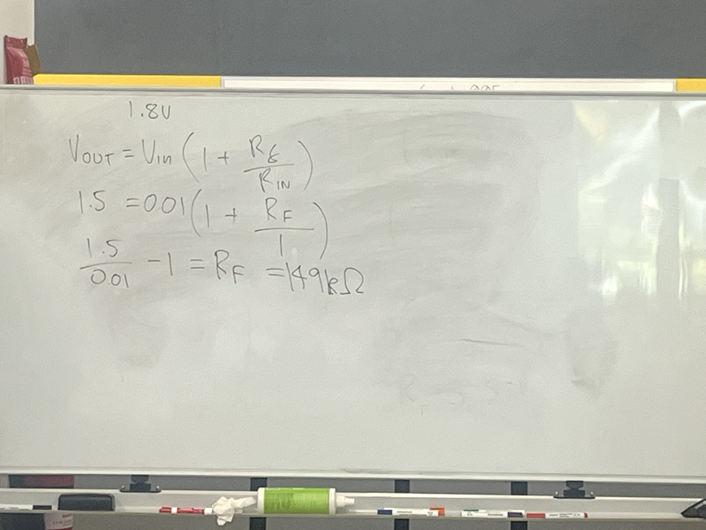
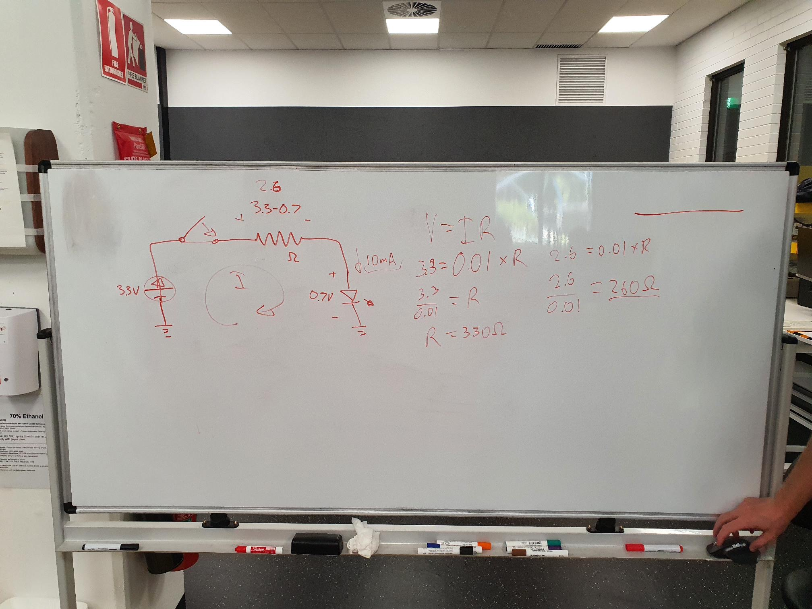
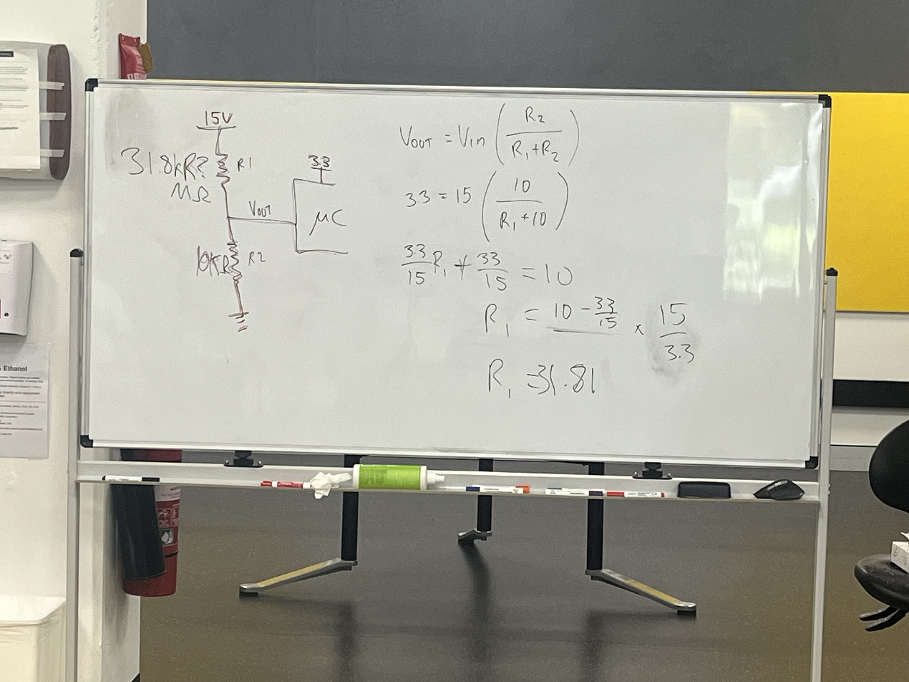

### Table of Contents <!-- omit from toc -->
- [Objectives](#objectives)
- [Requirements](#requirements)
- [Resources](#resources)
- [Procedure](#procedure)
- [1.0 Watch the introduction by Fergus](#10-watch-the-introduction-by-fergus)
- [2.0 Follow the hands on demonstration with Jacob](#20-follow-the-hands-on-demonstration-with-jacob)

## Objectives
1. Familiarise ourselves with the fundamentals of electrical circuits.
2. Familiarise ourselves with how to wire up basic digital ICs (integrated circuits) including decoupling capacitors.
4. Build a basic circuit to turn an LED on and off.
5. Wire up a temperature sensor for future use with the microcontroller.
6. Use a multimeter to measure voltages in our circuits.

## Requirements
1. STM32CubeIDE installed on device
2. Pen and paper
3. STM32L432KC Microcontroller with usb a to micro usb cable

## Resources
- STM32L4 Datasheet link: https://www.st.com/resource/en/reference_manual/rm0394-stm32l41xxx42xxx43xxx44xxx45xxx46xxx-advanced-armbased-32bit-mcus-stmicroelectronics.pdf
- What is an ADC: https://learn.sparkfun.com/tutorials/analog-to-digital-conversion/all#:~:text=An%20Analog%20to%20Digital%20Converter,the%20analog%20world%20around%20us.
- Coding in STM32CubeIDE: https://wiki.st.com/stm32mcu/wiki/STM32StepByStep:Getting_started_with_STM32_:_STM32_step_by_step

## Procedure
## 1.0 Watch the introduction by Fergus

