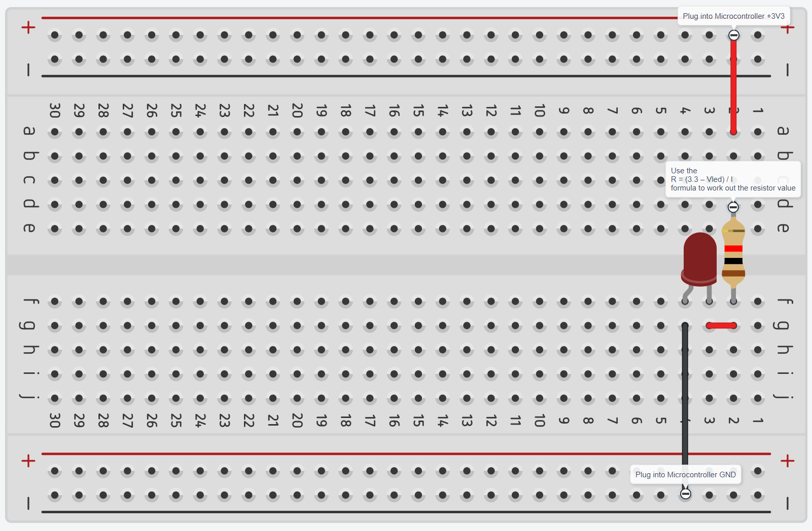

### Table of Contents <!-- omit from toc -->
- [Objectives](#objectives)
- [Requirements](#requirements)
- [Resources](#resources)
- [Procedure](#procedure)

## Objectives
1. Build a basic circuit to turn an LED on and off.
5. Wire up a temperature sensor for future use with the microcontroller.
6. Use a multimeter to measure voltages in our circuits.

## Requirements
1. Electronic components: Breadboard, resistors, solidcore wire/ standard male-male jumpers, LED.
2. Multimeter
3. Pen and paper 
4. STM32CubeIDE installed on device
5. STM32L432KC Microcontroller with usb a to micro usb cable

## Resources

- [Coding in STM32CubeIDE](https://wiki.st.com/stm32mcu/wiki/STM32StepByStep:Getting_started_with_STM32_:_STM32_step_by_step)
- Simple LED Circuit ([Instructables](https://www.instructables.com/Simple-Basic-LED-Circuit-How-to-Use-LEDs/))
- [Pinmap](/1.%20Payload%20Hardware%20Development/BinarX_Rocket_Payload_Microcontroller_Board_Pin_Labels.png)

## Procedure
### 1.0 Follow the hands on demonstration with Jacob <!-- omit from toc -->
BinarX youtube walkthrough with Jacob - [Session 1.3](https://youtu.be/c4AYyQy6dpM?si=3i30rcex_vjnUiQZ)

The goal is to create this circuit:

