### Table of Contents <!-- omit from toc -->
- [Objectives](#objectives)
- [Requirements](#requirements)
- [Resources](#resources)
- [Procedure](#procedure)
- [1.0 What is a Microcontroller](#10-what-is-a-microcontroller)
- [2.0 STM32CubeIDE](#20-stm32cubeide)
- [3.0 Coding in C++](#30-coding-in-c)

## Objectives
1. Understanding the purpose of a Microcontroller
1. Understanding the fundamentals of C++ code
1. Getting started with STM32CubeIDE

## Requirements
1. STM32CubeIDE installed
2. STM32L4 microcontroller board
3. USB-A to USB-C cable

## Resources
- STM32MCU Basics: https://wiki.st.com/stm32mcu/wiki/STM32StepByStep:STM32MCU_basics
- C++ Tutorials: https://www.w3schools.com/cpp/default.asp

## Procedure
## 1.0 What is a Microcontroller
A microcontroller is a small computer on a single integrated circuit. A microcontroller contains one or more CPUs along with memory and programmable input/output peripherals.

On the other hand, a microprocessor is just an integrated circuit that contains all the functions of a central processing unit of a computer.

### Microcontroller vs Microprocessor <!-- omit from toc -->
| Heading        |                                                                                                                                     Microcontroller                                                                                                                                      |                                                                                                                                                                                  Microprocessor |
| :------------- | :--------------------------------------------------------------------------------------------------------------------------------------------------------------------------------------------------------------------------------------------------------------------------------------: | ----------------------------------------------------------------------------------------------------------------------------------------------------------------------------------------------: |
| Functionality  | A microcontroller is an integrated circuit designed to perform a specific task in an embedded system. It typically includes a processor, memory and input/output peripherals on a single chip. it's designed to be an all-in-one solution for controlling devices in an embedded system. | A microprocessor is essentially the CPU or processing unit of a computer system. It therefore, doesn't include the additional features a microcontroller has such as memory or I/O peripherals. |
| Applications   |                                                          Used in devices where automation of a specific task is needed. Such as home appliances, automobiles, medical devices, space craft, and other various embedded systems.                                                          |                                                                                                  Utilized when there is a high computing demand in devices such as, PC's, smartphones, servers. |
| Complexity     |                                                                                             A less complex processor but depending on the additional features could be a more complex chip.                                                                                              |                                                                                               Due to the one dimensional purpose the processing side of this chip is considerably more complex. |
| Memory/Storage |                                                                             Has small amounts of onboard memory and storage, limited but typically sufficient for the application it is designed to perform.                                                                             |                                                                                        Relies on external memory and storage allowing for greater capacity in a larger and more complex system. |


## 2.0 STM32CubeIDE

<!-- From: AERO3001 Spacecraft Project Week 5 Laboratories 1 & 2
    Introduction to Microcontroller Embedded Software Development
    By: Robert Howie -->
STM32CubeMX is an initialisation code generator for STM32 embedded software development provided by STMicroelectronics. It makes getting started with STM32 software much faster as you can generate code to configure the hardware quickly and easily from a graphical user interface instead of having to reading bit values from the reference manual.

Software development with CubeMX isn’t as simple as a higher level software framework such as Arduino or RTOS (real-time operating system) and framework as ARM Mbed, but it significantly easier than starting from scratch without code generation, and, as a first party solution provided by ST, it does allow you to utilise all of the microcontroller functionality.

CubeMX will generates code using either of ST’s hardware APIs (application programming interfaces): the higher level hardware abstraction layer (“HAL”) which offers input checking and similar usage across STM32 device families or the lower level (“LL”) API which is closer to the hardware, more optimised but less portable and requires deeper knowledge of the microcontroller and peripheral hardware. We’ll be using the HAL but you’re free to use the lower level functions if you wish.

Software development with STM32CubeMX (inside STM32CubeIDE) and the STM32Cube hardware abstraction layer (HAL) is a good way to start as it helps you understand the tight coupling between hardware and software in (microcontroller) embedded software development, and it allows you to familiarise yourself with the STM32Cube APIs which are usually still available for specific hardware functionality in high level software frameworks such as ARM Mbed or Zephyr. The graphical initialisation code generation offered by STM32CubeMX significantly reduces the barrier to getting started, and is useful for pin mapping and to figure out possible hardware configurations even if you’re using a higher level software framework.

### 2.1 Creating a project <!-- omit from toc -->
1. Open STM32CubeIDE.<br><br>**IMPORTANT NOTE:** if you are using a lab computer you will have an older version of CubeMX. You will not be able to follow these steps and hence you must download [this](/2.%20Payload%20Software%20Development/2.1.%20Getting%20Started%20with%20STM32%20Microcontroller%20Programming/2.1.%20Getting%20Started%20with%20STM32%20Microcontroller%20Programming.ioc) file. Please skip to [step 3](#30-coding-in-c).
2. Select "File>New>STM32 Project" to create a new STM32 project using CubeMX:

   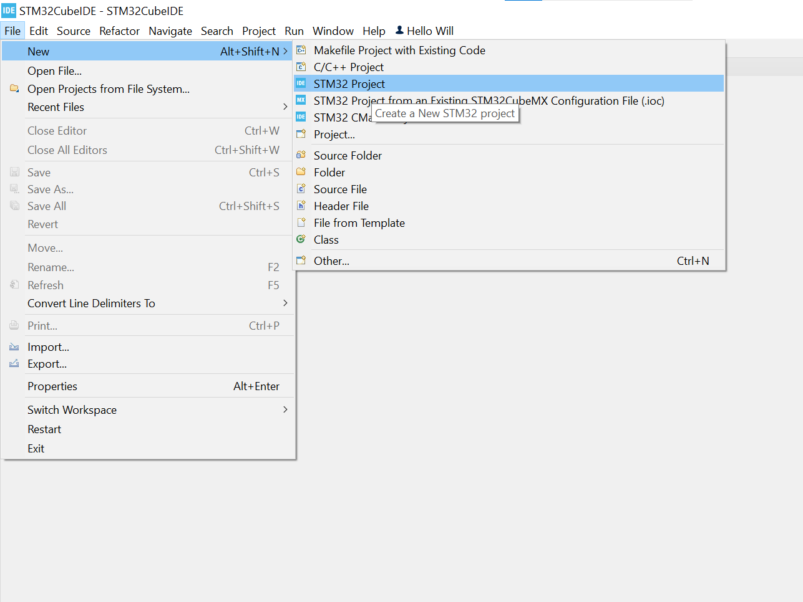

    You may have to wait for new hardware information to be downloaded.

3. In the "Commercial Part Number" box type "L433CBT7

   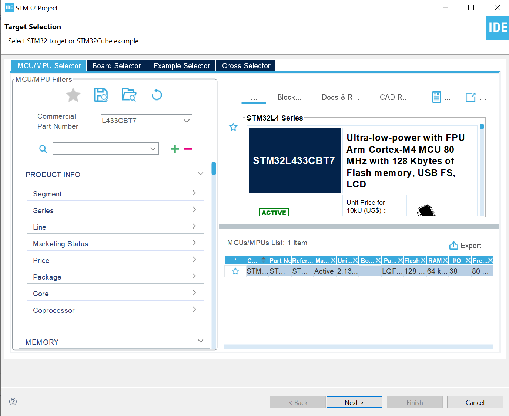

4. Click the item and then "Next"
5. Give your project a relevant name such as "Wills L433CBT7 CubeMX Project"
6. Select C++ as the targeted language.
   
   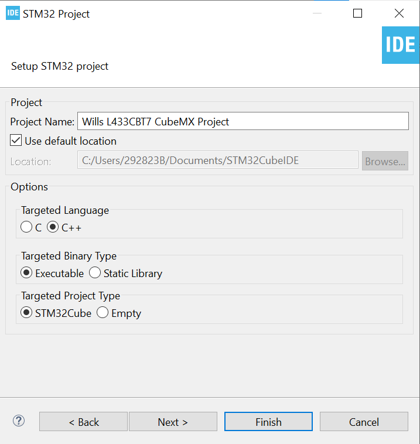

7. Select "Finish" and wait for the API files to download.

    Once Complete you should be presented with this screen:

    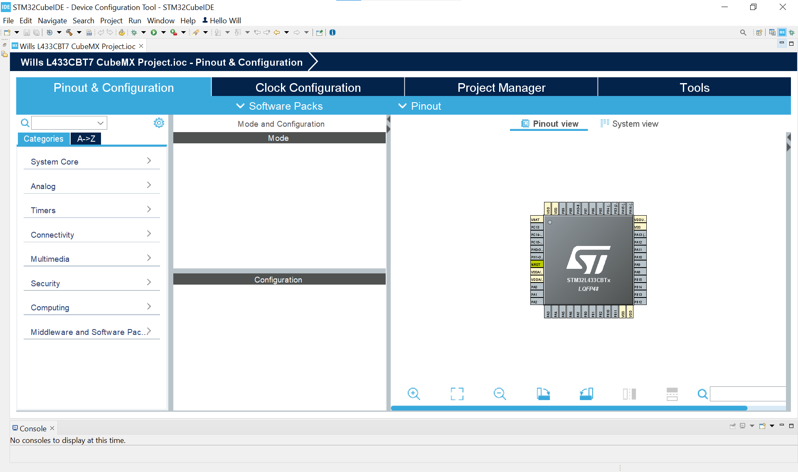

### 2.2 Configuring Debug and Hardware Peripheral Pinout <!-- omit from toc -->

1. Expand the “System Core” category on the left side of the window and click on “SYS”.
2. Click the “Debug” dropdown and click “Trace Asynchronous Sw” 

    This is the option for debugging via serial wire debug (SWD) with the SWO (serial wire output) enabled using only Three pins: SWDIO, SWCLK and SWO.

    You should now see a green tick in the “SYS” category: 

    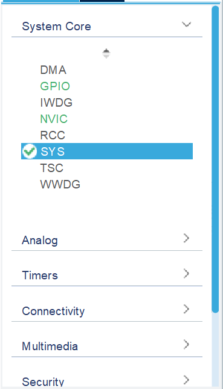

    In the pinout view, two pins should have been assigned for the debug connections. These pins will turn green and labels will appear next to them:

    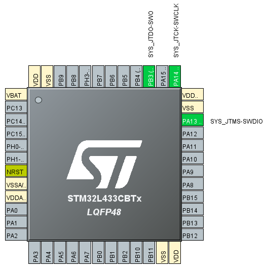

3. Now, expand the RCC category as we want to initialise the external clock crystals.

    Set both the High Speed Clock (HSE) and the Low Speed Clock (LSE) to "Crystal/Ceramic Resonator".

    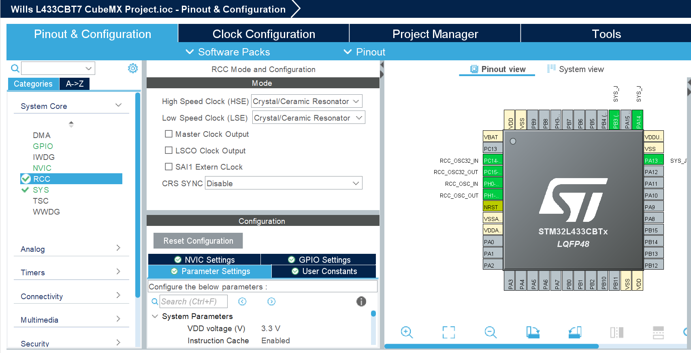

    Soon we'll set up the external clocks more thoroughly.

### 2.3 Clock Configuration <!-- omit from toc -->

1. Click on the Clock Configuration tab at the top

    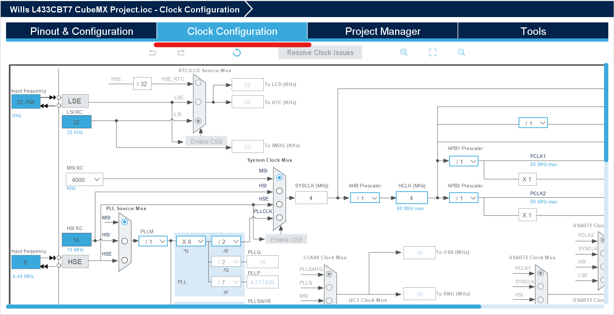

2. We want to utilize the HSE. This means we need to select "HSE" under the "PLL Source Mux" and "PLLCLK" under "System Clock Mux". This allows us to have different clock speeds whilst maintaining an output clock tied to the HSE.

    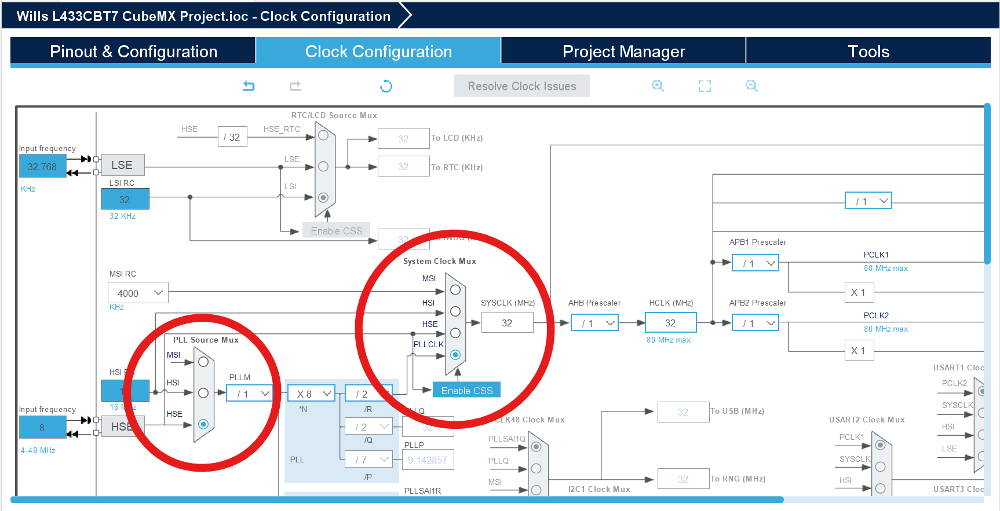

3. Next we need to set the speed to 16MHz by writing it in the "Input frequency" text box

    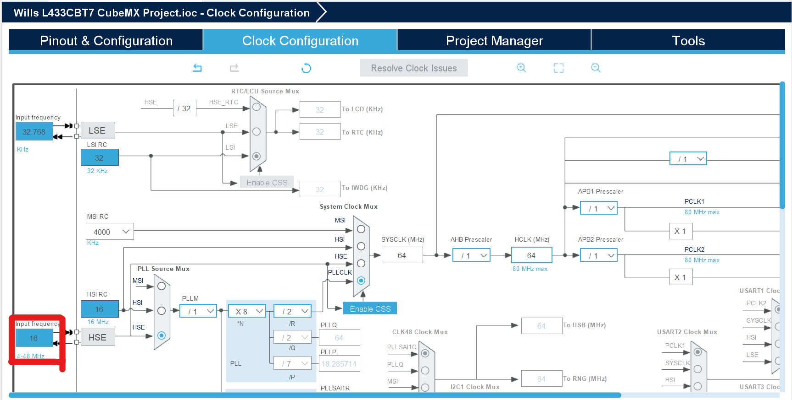

4. Lastly, change the *N to X10 to make the output from "System Clock Mux" equal 80MHz
   
   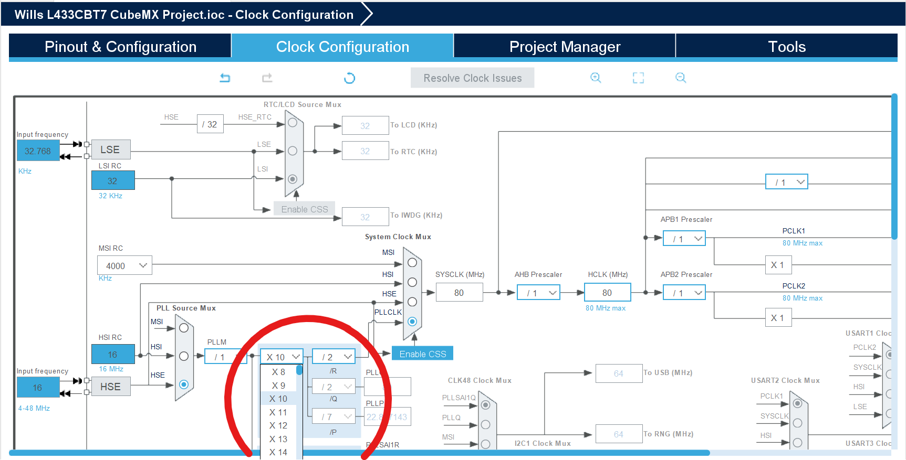

5. at the end should look like this:

    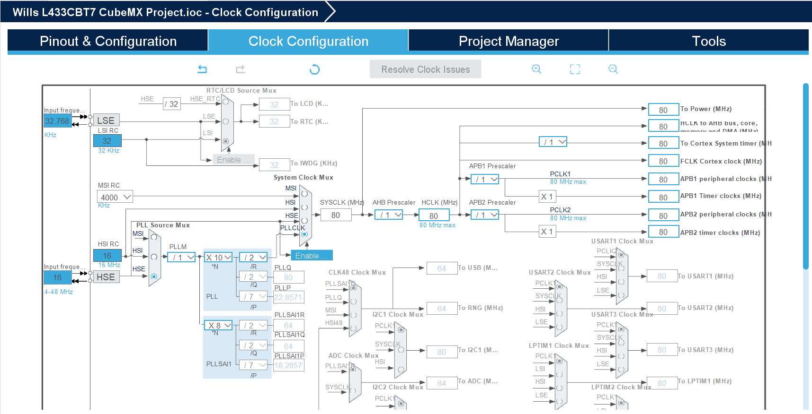

We've now finished the setup ready for peripheral additions. Now "ctl + s" to save the configuration. It will then ask you if you would like to generate code, select 'Yes'. It will then ask if you would like the C/C++ perspective, select 'Yes' again.
<br>

## 3.0 Coding in C++

### *The skip to step 3 people:* <!-- omit from toc -->
You'll need to load the file you have downloaded above in the STM32CubeIDE loaded onto the lab machines. Ask a subject matter expert (SME) to help if you are having issues. 

### Variables <!-- omit from toc -->


Variables hold information and allow for the programmer to store and manipulate data. Each variable may have a different type depending on the information you want to store and how you want to manipulate the data.

1. **Integers**
   
   ```c++
   int x = 0;
   ```

2. **Arrays**

    ```c++
   int x[] = {0,1,2,3,4};
   ```

3. **Strings**

    ```c++
    string x = "BinarX";
    char[20] = "AnotherString"
    ```

    <details>
    <summary>What does char[20] mean?</summary>
    <br>
    A char is a data type that holds characters, such as 'B', '1', 'n', 'a', or 'R'. However, the square brackets denote that this is an array (or vector) of 20 chars. You could change this number inside the square brackets to change how many characters the array can hold. In our case though it can hold up to 20 characters, which can be used to form a sentence or word. Hence, it is another form of string.
    </details>
<br>

**Tips for variables**
- ensure you name them with a meaningful name
- ensure the variable type is appropriate for the use case
- There are typically two styles of variable names:
```C++
int camelCase;
char under_score;
```

Find out more [here.](https://www.w3schools.com/cpp/cpp_variables.asp)

### Conditional Statements <!-- omit from toc -->

Conditional statements allow for coders to have dynamic pathways throughout their code. The pathway is dependant on the dynamic variable values. Hence, there needs to be clearly defined rules to ensure consistency throughout the code. 

**Logic Statements**

Logic statements allow for the comparison between two boolean (1 and 0) values.

| Symbol | word |                                            Definition |
| :----- | ---- | ----------------------------------------------------: |
| &&     | AND  |    needs both one variables to be TRUE to output TRUE |
| \|\|   | OR   | needs at least one variable to be TRUE to output TRUE |


**Logic Conditions**

On the other hand, logic conditions allow for the comparison between singular numerical values
| Symbol |               Definition |
| :----- | -----------------------: |
| <      |                Less than |
| <=     |    Less than OR equal to |
| >      |             Greater than |
| >=     | Greater than OR equal to |
| ==     |                 Equal to |
| !=     |             NOT equal to |

1. **```if``` Statements**
    
    If statements are the most common type of conditional statements as they see if the boolean value inside the brackets is true to proceed.

    **Note:** the "if" statement sequentially checks each statement to be TRUE and follows that path first. Meaning if multiple statements would be TRUE it will enter the one closest to the top.

    **Example 1**
    ```c++
    if(a < b || a > b)
    {
        printf("a and b are not equal");
    }
    ```
    *find which logic condition would simplify the above statement*

    **Example 2**
    ```c++
    if(a > b)
    {
        printf("a > b");
    }
    else
    {
        printf("a <= b");
    }
    ```

    **Example 3**
    ```c++
    if(a > b && a > c)
    {
        printf("a is the largest number");
    }
    else if(b > a && b > c)
    {
        printf("b is the largest number");
    }
    else
    {
        printf("c is the largest number");
    }
    
    ```


2. **SWITCH Statements**

These are unlikely to be used within this development but if you're interested they're described effectively [here](https://www.w3schools.com/cpp/cpp_switch.asp).


### Loops <!-- omit from toc -->
loops allow for the coder to further simplify operations that need to completed multiple times. 

**WHILE**

A while loop allows for a piece of code to be continuously looped until a preset condition is met.
A simple demonstration of a while loop is incrementing a number:
```c++
x = 0;
while (x <= 10)
{
    x = x + 1;
}
```
The previous code block first sets x to 0 then enters into the while loop where it checks if the statement (x < 10) is true. If the statement is true then the code inside the while loop will be run, which in this case is to
increment x by one. Once the program reaches the bottom of the while loop it will jump back to the top and check if the previously mentioned statement is still true now that changes have been made. The while loop will continue to run and x will continue to be incremented until the while statement is no longer true; when x is greater than 10. If the while loop statement is not true the while loop will be skipped over. 

**DO WHILE**

A do while loop is very similar to while loop with the key difference being that a do while loop will always run through the loop at least once even if the loop statement is not true/met. 
For example:
```c++
x = 15;
do
{
    x = x + 1;
} while (x <= 10);
```
In the above code block example the program will first set x to 15, increment x by 1 and then check if the statement (x <= 10) is true. In this case as the do while statement is false the loop will only be ran once. 

**FOR**

A for loop is a method of looping code that allows the program to be looped a specific amount of times. Where a while loop and a do while loop can run on continuously until the loop's statements/conditions are met, a for loop can have a chosen number of loops.
For example:
```c++
for (int x = 0; x < 5; x = x + 1)
{
    printf("Hello There");
}
```
The for loop can be broken down into 3 main statements/conditions.

   for (_statement1_; _statement2_; _statement3)

statement1 is the starting condition of the loop, in the previous example x was intialised as an integer number and set to 0.

statement2 is the ending condition of the loop, as seen in the previous example the loop will continue until x is greater than 3.

statement3 is the incrementing value of the loop, once the loop reaches the bottom it will increment by the amount set by statement3, in the previous example x will be increased by one once it reaches the bottom of the loop.

Therefore the previous for loop will print Hello There 5 times. 

Although the previous for loop has been written to show an incremental change in x. The loop can be modified to allow for a decremental change in x.

```c++
for (int x = 10; x > 5; x = x - 1)
{
    printf("Hello There");
}
```

