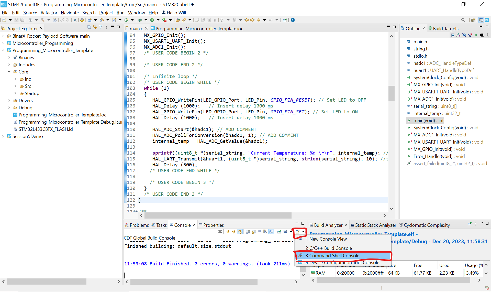
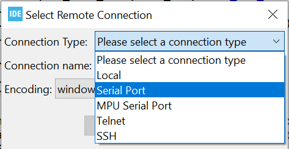

# Session 5: Reading Sensors With a Microcontroller <!-- omit from toc -->

### Table of Contents <!-- omit from toc -->
- [Objectives](#objectives)
- [Requirements](#requirements)
- [Resources](#resources)
- [Procedure](#procedure)
- [1.0 STM32IDE Project Initialisation](#10-stm32ide-project-initialisation)
- [2.0 C Code Fundamentals](#20-c-code-fundamentals)
- [3.0 ADC Implementation](#30-adc-implementation)
- [4.0 Extension](#40-extension)

## Objectives
1. Download zip file with partially completed STM32 initialisation
1. Initialise internal temperature sensor
1. Understand the role of an ADC in data acquisition 
1. Read and display raw ADC data

## Requirements
1. STM32CubeIDE installed on device
1. Pen and paper
1. BinarX Rocket Payload Controller Microcontroller Board with STM32L433CBT7 microcontroller

## Resources
- STM32L4 reference manual: https://www.st.com/resource/en/reference_manual/rm0394-stm32l41xxx42xxx43xxx44xxx45xxx46xxx-advanced-armbased-32bit-mcus-stmicroelectronics.pdf
- What is an ADC article by SparkFun Electronics: https://learn.sparkfun.com/tutorials/analog-to-digital-conversion/all#:~:text=An%20Analog%20to%20Digital%20Converter,the%20analog%20world%20around%20us.
- Coding in STM32CubeIDE: https://wiki.st.com/stm32mcu/wiki/STM32StepByStep:Getting_started_with_STM32_:_STM32_step_by_step

## Component Links
- Red LED: https://www.altronics.com.au/p/z0751a-red-800mcd-3mm-led/
- Blue LED: https://www.altronics.com.au/p/z0869-blue-1000mcd-5mm-led/
- White LED: https://www.altronics.com.au/p/z0876e-white-22500mcd-5mm-led/
- UV LED: https://www.altronics.com.au/p/z0883-uv-1600mcd-5mm-clear-led/

## Procedure
## 1.0 STM32IDE Project Initialisation
To begin our journey into learning how these complex devices are used, we first need to set up our devices for the correct functionality. Hence, we use STMCubeIDE to modify the pin functionalities.

1.	Open the STM32CubeIDE file we were working on in the [previous session (3.1)](/2.%20Payload%20Software%20Development/2.1.%20Getting%20Started%20with%20STM32%20Microcontroller%20Programming)

5.	Expand the “Analog” category on the left side of the window and click on “ADC1”.

    This is the configuration for the built in analogue to digital converter “ADC1”. This hardware peripheral measures analogue voltages and digitises them, storing the conversion result in a register for use in software. This allows you to write software that can respond to changing voltages or values from sensors that output their result as an analogue voltage level.


3.	Scroll through the ADC1 “Mode and Configuration” tab that just appeared and search for “IN5”. Click on the drop-down menu and select “IN5 Single-ended”.

    We’re going to read from a external temperature sensor connecting external circuity to the one of the ADC input pins.


4.	We’re also going to use a GPIO pin as an output to drive an external LED. In the “Pinout view” left click on the pin connected to “PB1” LED and select “GPIO_Output”.

5. Right click on the “PB1” pin, and give it a user label: “LED”.

   Now we're going to set up the UART (universal asynchronous receiver-transmitter) serial communication peripheral which we will use to send messages to the computer to help with software development. 
    
    The “VCP” (virtual com port) TX (transmit) and RX (receive) lines in the built in ST-LINK debugger are connected are connected to the “PA9” and “PA10” pins on the L4.

6.	Left click on “PA9” and select “USART1_TX”. 

7.	Left click on “PA10” and select “USART1_RX”.

8.	Now look to the left hand side and select the “connectivity” drop down menu and change the “mode” drop down the “Asynchronous”.

    The “PA9” and “PA10” pins in the pinout view should now turn green as they have a valid configuration. 

    You’re pinout view should look like this:


9.	Look down in the “Parameter Settings” (Middle bottom pane) for “USART1” and make a note of the “Baud Rate” in your notebook. We’ll need to set our serial console viewer to the same settings to receive the messages later. 

10. Save your project and make sure to allow the regeneration of code.

You’re now finished configuring STM32 for the rest of the session!

## 2.0 C Code Fundamentals

This section aims to complete the "Hello World" of micro controllers which is blinking an LED. 

**LAB INSTRUCTORS WILL SHOW PHYSICAL CIRCUIT**

1.	Look at the left hand project file explorer tab and open *PROJECT NAME* -> core -> src -> main.c.


2.	Find the while loop within the main function!


3.	Using a combination of these commands and variables sequence code within the while loop to blink the led. 
    
    *Remember to comment each line to explain it's functionality*

```c++
HAL_GPIO_WritePin(LED_GPIO_Port, LED_Pin, GPIO_PIN_RESET); // Set LED to OFF
HAL_Delay (1000);   // Insert delay 1000 ms
HAL_GPIO_WritePin(LED_GPIO_Port, LED_Pin, GPIO_PIN_SET); // Set LED to ON
HAL_Delay (1000);   // Insert delay 1000 ms 
```

**NOTE: DON'T FORGET YOUR SEMICOLONS!!!**

4. Rebuild your file (click the hammer icon) and in the “Console” window at the
bottom of the screen you should see “Build Finished. 0 errors, 0 warnings.”


5. Using the play button check to see if the code runs by watching the LED to see if it begins flashing as programmed. 

## 3.0 ADC Implementation

TMP36 Temperature sensor datasheet: https://www.analog.com/media/en/technical-documentation/data-sheets/tmp35_36_37.pdf.

1. Comment out the LED blink code in the while loop using:
```c++
/*
LED blink code in here
*/
```
2. Insert the line below to start the ADC using the blocking HAL function, in the while loop, and add a comment to define it's function.

```c++
HAL_ADC_Start(&hadc1); // ADD COMMENT
```

3. Add the poll for conversion command below to assign the ADC value to ADC1's address. Add comments to what *you* think the function does.
```c++
HAL_ADC_PollForConversion(&hadc1, 1); // ADD COMMENT
```

4. Declare static variables under "USER CODE BEGIN 1" to hold the temperature data and a string that can be used to print to serial

    The term "static" is a variable initialisation prefix that ensures that it remains initialised no matter the scope.
    
    The "uint8_t" is a variable initialisation prefix defines the variable as an unsigned 8-bit integer. Similarly "uint32_t" defines a 32-bit integer.

    Lastly, the square brackets after "serial_string" define the variable as an array which in most cases it's size must be defined for the compiler.

```c
static uint8_t serial_string[51] = ""; // Static 50 character buffer for serial communication
static uint32_t sensor_temp = 0; //Static 32 bit unsigned integer to hold value for sensors temperature
```

5. To record the current ADC value to "sensor_temp" variable we need to use the function below to access the data at the memory location assigned to ADC1.

```c
sensor_temp = HAL_ADC_GetValue(&hadc1);
```

6. To send the data to the console use the functions below.

    The "sprintf" function writes the second string to the first string. The %d in the second string defines a variable integer value is to be substituted, hence, the "internal_temperature" value after.

    To transfer the data to the computer the "HAL_UART_TRANSMIT" function is utilized such that the UART2 channel is employed.

    Lastly, similar to the LED blink function a delay is added to reduce the amount of messages sent to the computer.

```c++
sprintf(*serial_string, "Current Temperature: %d \r\n", sensor_temp); //Assign string buffer to the temperature value

HAL_UART_Transmit(&huart1, (uint8_t *)serial_string, sizeof(serial_string), 10); //transmit serial_string with a 10ms timeout using USART1
HAL_Delay(500);
```

<!-- 
7. To observe the intermittent sending to the computer, a console must be set up to observe the messages. firstly, click the debug button (which looks like a green bug) to compile you code and uploaded it to the STM32L4 via the ST-LINK debugger built into the development board:


    The “Edit Configuration” dialog will appear:

**Image of image of where edit config is**


1.  Click “OK” at the bottom of the window.

-->

7. Click on the “Console” tab at the bottom of the window:

**Image of where the console tab is**


8.  Click on the “Open Console” to the left of the “Minimise” and “Maximise” buttons near the top right of the console window:



9.  A menu will pop up; select the “Command Shell Console” option:


10.   In the “Select Remote Connection” dialog that appears configure select “Serial Port” for the “Connection Type” and click the “New...” button




11. Give the connection an name such as “STM32L4 VCP”, select the correct serial port.
   
    You may need to check which port is the correct device with device manager on Windows or some other method on other platforms.

12. Check that the baud rate is the same as the one that was configured for USART1 in CubeMX. (You wrote it down in your notebook.) You can also check the other parameters if you wish or ar having problems.


13. Click “Finish” and you’ll be returned to the “Select Remote Connection” dialog.

14. Ensure your new connection is selected in “Connection Name” and press the “OK” button.
   
   You should now see the connected status message at the top left of your console window for your serial connection:
   


15. Now run your code and you should see your temperature message in the console.

16. You can pin the console using the console with the green pin symbol shown below:


## 4.0 Extension
Connect the LED blink to a common temperature that you see using conditional statements in the while loop. This simulates a basic temperature control system which initiates once the internal temperature reaches a specific threshold in either direction.


