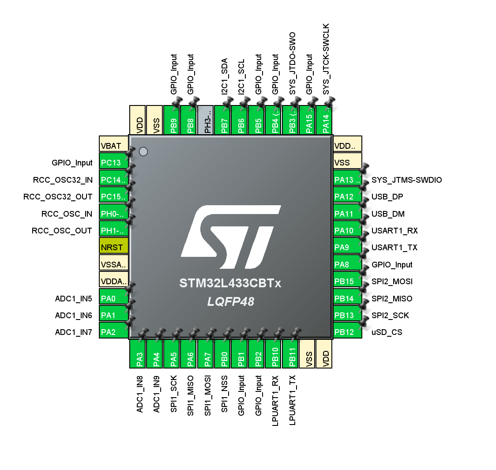
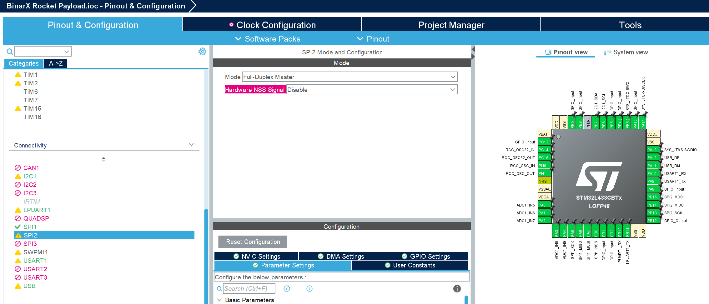
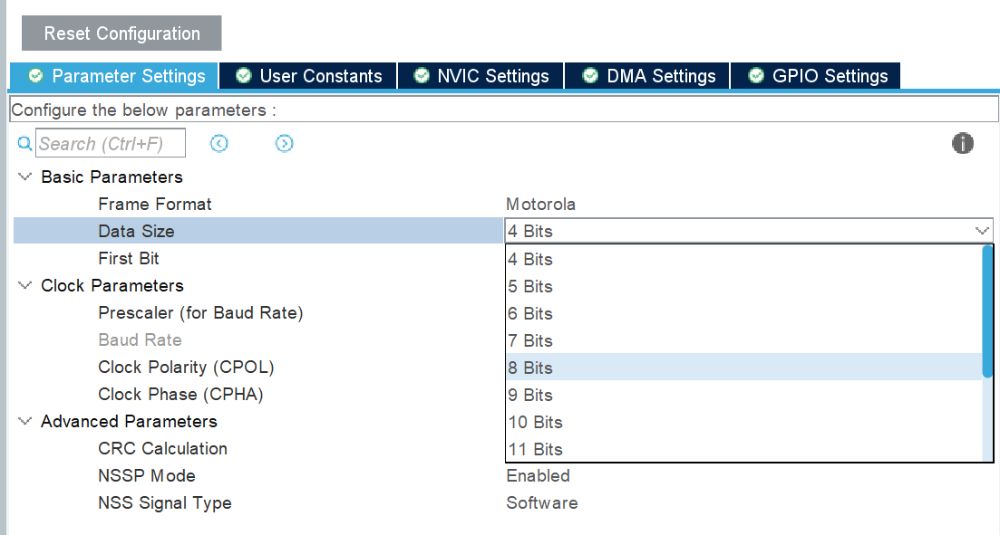
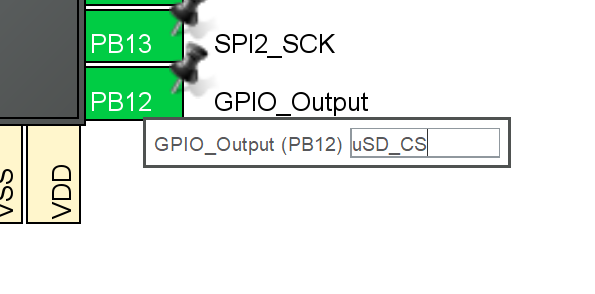
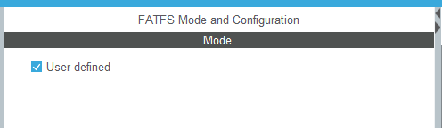

### Saving Data to A MicroSD Card

## Resources:
- Tutorial by kiwih: "Tutorial: An SD card over SPI using STM32CubeIDE and FatFS" https://01001000.xyz/2020-08-09-Tutorial-STM32CubeIDE-SD-card/.
- https://controllerstech.com/sd-card-using-spi-in-stm32/
- "SPI Signal Names" by SparkFun Electronics: https://www.sparkfun.com/spi_signal_names

## Required Software & Equipment
- BinarX Rocket Payload Microcontroller Board
- MicroSD Card
- STM32CubeIDE
- STLink STM32 Dubugger & Programmer

## Procedure

### Configure the SPI Hardware for operation with a MicroSD Card

SPI or serial peripheral interface is a common serial interface for connecting sensors and peripherals to a processor or two processors or controllers to each other. It's called a serial interface as the bits of information are sent one after another down a single line or single pair of lines (instead of bits alongside each other which is called a parallel interface).

On our rocket payload microcontroller board, the MicroSD card slot is connected to the ```SPI2``` serial peripheral interface. (This microcontroller has three, ```SPI1```, ```SPI2``` and ```SPI3```, although the board is only specifically configured for ```SPI1```and ```SPI2```.) This SPI connection is how the payload data is transferred to the microSD card for us to process on the ground after the flight.

You can see the connections on the MicroSD card holder:


You can also see that SPI1 and SPI2 are brocken out to the female header connectors that go to your payload prototyping board:


It is possible to connect multiple devices to one SPI peripheral by using a separate GPIO pin for each device's CS line, but for your payloads we recommend you keep things simple, and use ```SPI1``` for any sensors and leave ```SPI2``` for just the microSD card.

You can see how all these lines connect to the microcontroller itself below. We call this assignment the "pin mapping":


__It's important that the pin mapping in your software (specifically the STM32CubeMX .ioc file inside STM32CubeIDE) match up with the board, otherwise your software won't work as expected.__

The reason that we have to do this step is because the STM32 microcontrollers offer a lot of flexibility in terms of which pins the built in peripherals are connected to. They can be remapped in software, which helps maximise the usefulness of the constrained number of pins, but does mean that you have to keep track of how you have have connected them in hardware and make sure the software pin mapping matches up.

The fully mapped out pin assignment in CubeMX for the BinarX Rocket Payload Microcontroller Board looks like this:


It's not required that you assign all of these pins in CubeMX (the intialisation code generator that is part of STM32CubeIDE), however. You only need to assign the pins that are used by your design. At a minimum, this would be:

- the HSE oscillator pins as the HSE oscillator is being used as your clock source,
- the SWD pins for programming and debugging,
- the USART1 pins for the debug UART so you can get debugging messages from your board during software development,
- the SPI2 & card detect pins for the microSD card holder, so you can save your payload data to the microSD card, and
- whatever pins are required for your payload sensor (likely ACD, I2C or SPI pins).


1. Configure the SPI2 periphral for "Full Duplex Controller" (formerly known as "Full Duplex Master") with no chip select ("CS") signal (sometimes formerly referred to as slave select, "SS" or "NSS")

    

   You can find an article explaining SPI signal names and why they have changed recently here if you are interested: https://www.sparkfun.com/spi_signal_names.

1. Set the "Data Size" to "8 bits":

    

1. Configure PB12 as a "GPIO Output" and give it the label "uSD_CS":

    

1. Set the prescaler to 128, which with the 16 MHz, HSE oscillator should give you a baud rate of 125 KBits/s:

    

1. Move over to the "Clock Configuration" tab, and click "Resolve Clock Issues" if needed.

1. In the left hand side, scroll down to "Middleware and Software Packs", click on FATFS:

    

    then enable it by ticking "User-defined" in the middle pane:

    

1. Save, and generate code.

<video loop src="https://github.com/BinarX-Curtin/School-Holiday-Program/assets/12658669/448ba34d-c790-4e87-bf11-20757312fbbc">  video </video> 


https://github.com/BinarX-Curtin/School-Holiday-Program/assets/12658669/448ba34d-c790-4e87-bf11-20757312fbbc


