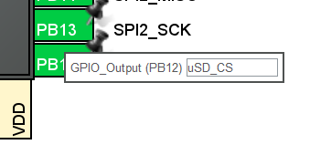

# Manipulating and Storing Sensor Data with a Microcontroller

# Objectives
1. Configure the SPI subsystem on the microcontroller to communicate with an SD card.
2. Write sensor data to the SD card in a format that will be readable by the data processing software you will develop in the future.

# Resources:
- [Tutorial by kiwih](https://01001000.xyz/2020-08-09-Tutorial-STM32CubeIDE-SD-card/): "Tutorial: An SD card over SPI using STM32CubeIDE and FatFS".
- "SPI Signal Names" ([SparkFun Electronics](https://www.sparkfun.com/spi_signal_names))
- [STM32L4 HAL Documentation](https://www.st.com/resource/en/user_manual/um1884-description-of-stm32l4l4-hal-and-lowlayer-drivers-stmicroelectronics.pdf)

# Required Software & Equipment
- BinarX Rocket Payload Microcontroller Board
- MicroSD Card
- STM32CubeIDE
- STLink STM32 Debugger & Programmer

# Procedure

## 1.0 Introduction to SPI & MicroSD Card Connections

SPI or serial peripheral interface is a common serial interface for connecting sensors and peripherals to a processor or two processors or controllers to each other. It's called a serial interface as the bits of information are sent one after another down a single line or single pair of lines (instead of bits alongside each other which is called a parallel interface).

On our rocket payload microcontroller board, the MicroSD card slot is connected to the SPI2 serial peripheral interface. (This microcontroller has three, SPI1, SPI2 and SPI3 peripherals, although the board is only configured for SPI1 and SPI2.) This SPI connection is how the payload data is transferred to the microSD card for us to process on the ground after the flight.

You can see the connections on the MicroSD card holder:


You can also see that SPI1 and SPI2 are broken out to the female header connectors that go to your payload prototyping board:


It is possible to connect multiple devices to one SPI peripheral by using a separate GPIO pin for each device's CS line, but for your payloads we recommend you keep things simple, and use SPI1 for any sensors and leave SPI2 for just the microSD card.

You can see how all these lines connect to the microcontroller itself below. We call this assignment the "pin mapping":


> *It's important that the pin mapping in your software (specifically the STM32CubeMX .ioc file inside STM32CubeIDE) match up with the board, otherwise your software won't work as expected.*

The reason that we have to do this step is because the STM32 microcontrollers offer a lot of flexibility in terms of which pins the built in peripherals are connected to. They can be remapped in software, which helps maximise the usefulness of the constrained number of pins, but does mean that you have to keep track of how you have have connected them in hardware and make sure the software pin mapping matches up.

The fully mapped out pin assignment in CubeMX for the BinarX Rocket Payload Microcontroller Board looks like this:


It's not required that you assign all of these pins in CubeMX (the intialisation code generator that is part of STM32CubeIDE), however. You only need to assign the pins that are used by your design. At a minimum, this would be:

- the HSE oscillator pins as the HSE oscillator is being used as your clock source,
- the SWD pins for programming and debugging,
- the USART1 pins for the debug UART so you can get debugging messages from your board during software development,
- the SPI2 & card detect pins for the microSD card holder, so you can save your payload data to the microSD card, and
- whatever pins are required for your payload sensor (likely ADC, I2C or SPI pins).

You should have configured these pins in CubeMX in the previous sessions: [2.1. Getting Started with STM32 Microcontroller Programming](/2.%20Payload%20Software%20Development/2.1.%20Getting%20Started%20with%20STM32%20Microcontroller%20Programming/Readme.md) and [2.2. Reading Sensors With a Microcontroller](/2.%20Payload%20Software%20Development/2.2.%20Reading%20Sensors%20With%20a%20Microcontroller/Readme.md).

## 2.0 Configure the SPI Hardware for Operation With a microSD Card

Starting from an existing STM32l433CBT7 STM32 project in STM32CubeIDE, follow the steps below to configure the the SPI2 peripheral for use with a MicroSD card.

1. Open STM32CubeMX in STM32CubeIDE by double clicking on the .ioc file in the project explorer on the left hand side of STM32CubeIDE:

    

2. Expand the "Connectivity" section in "Categories" on the left hand side and click on "SPI2":

    

3. In the middle pane, click on the "Mode" drop down at the top and change the mode to "Full Duplex Master" to configure the SPI2 subsystem as an SPI controller in full duplex mode. (Note that in SMT32CubeIDE the former term "master" is used instead of the up-to-date term "controller". For more information on the recent changes to SPI signal naming, please see [this article](https://www.sparkfun.com/spi_signal_names) by SparkFun Electronics.)

    In the second drop down ("Hardware NSS Signal") select "Disable" as the library we will be using to write to the MicroSD card controls the chip select line from software (requiring it to be configures as a GPIO output, not configured through the SPI2 peripheral). (Note that "slave select" and the abbreviations "SS" or "NSS" are the former terms for "chip select" with the abbreviation "CS".)

    The "Mode" options should look like this:

    

   If you would like more information on SPI signal names and why they have changed recently, you can [read this](https://www.sparkfun.com/spi_signal_names) SparkFun Electronics article.

4. To match up with the pin mapping shown above in the "Microcontroller Input-Output Connections" part of the schematic we need to configure

    - "PB15" as "SPI2_MOSI",
    - "PB14" as "SPI_MISO" and
    - "PB13" as "SPI2_SCK".

    Depending on how you have configured the other pins on the microcontroller, it's likely that "PB15" and "PB14" are configured correctly when you enable SPI2, but you'll have to manually click on "PB13" and select "SPI2_SCK" from the list of pin functionalities:

    

5. In the configuration panel in the lower middle of the screen, set the "Data Size" to "8 bits":

    )

6. Then, set the prescaler to 256:

    

   > *If your baud rate is showing up as more than 400 KBits/s. You may need to make changes in the "Clock Configuration" tab. Request assistance from the facilitators with this step.*

   Your SPI2 configuration should look like this:

   

7. Now we need to set up a pin as the GPIO output to control the chip select (CS) line for the micro SD card. Click on "PB12" in the right hand pane, and select "GPIO Output".

    The pin should now look like this:
    
    
    
8. Then, right click on it and give it the label "uSD_CS":

    \

    "PB12"-"PB15" should now look like this:

    

9. We're now going to set up a GPIO input to detect the presence of the microSD card in the slot. Click on "PC13" in the right hand pane, and select "GPIO Input":

    

10. Right click on "PC13", select "Enter User Label" and give the pin the user label "uSD_CD":

    .

The hardware connections are now configured to use the microSD card with the STM32 microcontroller. The next step is to add the middleware layer to the project that includes the filesystem that will allow us to create files on the microSD card.

## 3.0 Add FATFS Filesystem Middleware to the Project

In order to write files to the microSD card, we need to use a filesystem. ST makes it fairly easy to add the FATFS filesystem.

1. Still in CubeMX, in "Categories" on the left hand side, scroll down to "Middleware and Software Packs" at the bottom and click on FATFS:

    

2. Then, enable it by ticking the "User-defined" tick box in the "Mode" section in in the middle pane:

    !

    No changes are required in the "Configuration" section.

3. Now, save either by pressing the save icon in the menu bar, or by pressing Ctrl+S.

   You should be asked, "Do you want to generated Code?".

   Click "Yes" to generate the initilisation code for your project.


4. If you weren't prompted to generate code. You can complete this step manually, but clicking on the "Generate Code" button in the toolbar, which looks like a yellow cog on a grey shaft:

    

    or navigating to the "Project>Generate Code" command, via the main menu.

Our initialisation code has now been generated and we're nearly ready to begin using the microSD card to store data. First we need to make some adjustments to the FATFS filesystem library.

## 4.0 Making changes to the FATFS Filesystem Library for use with a microSD Card.

The FATFS library as provided by ST is designed for use with microcontrollers' internal flash memory. We need to make some changes in order to use it with the microSD card. Luckily for us, someone else has made most of the changes for us, and we just need to configure a couple of options, and provide the pin labels used for our microSD card.

This part is based on kiwih's tutorial [here](https://01001000.xyz/2020-08-09-Tutorial-STM32CubeIDE-SD-card/)  and builds upon code written by [ChaN](http://elm-chan.org/fsw/ff/).

1. In the "Project Explorer" pane on the left hand side of STM32CubeIDE there should now be a new "Middlewares" directory (below a new "FATFS" directory).

Expand this "Middlewares" directory which should reveal a subdirectory called "Third_Party":


Right click on the "Third_Party" directory and select "New>Folder".

Title the new folder "cubeide-sd-card":


2. Download both of these files from GitHub and put them in the "cubeide-sd-card" folder that you just created:

    https://github.com/kiwih/cubeide-sd-card/blob/master/cubeide-sd-card/FATFS/Target/user_diskio_spi.c

    https://github.com/kiwih/cubeide-sd-card/blob/master/cubeide-sd-card/FATFS/Target/user_diskio_spi.h

    You can drag and drop the files from your file explorer into the folder in STM32CubeIDE, if prompted to copy or link the files, choose to copy them.

    We need to make a couple of changes in these files to work with our microcontroller.

3. In "user_disk_spi.c", change line 27 which reads:

    ```c++
    #include "stm32f3xx_hal.h" /* Provide the low-level HAL functions */
    ```

    to

    ```c++
    #include "stm32l4xx_hal.h" /* Provide the low-level HAL functions */
    ```

    to refer to the L4 microcontroller family hardware abstraction libraries (HAL) instead of the F3 family.

4. Then, scroll down to lines 38 and 39:

    ```c++
    #define FCLK_SLOW() { MODIFY_REG(SD_SPI_HANDLE.Instance->CR1, SPI_BAUDRATEPRESCALER_256, SPI_BAUDRATEPRESCALER_128); }	/* Set SCLK = slow, approx 280 KBits/s*/
    #define FCLK_FAST() { MODIFY_REG(SD_SPI_HANDLE.Instance->CR1, SPI_BAUDRATEPRESCALER_256, SPI_BAUDRATEPRESCALER_8); }	/* Set SCLK = fast, approx 4.5 MBits/s */
    ```

    and change them to:

    ```c++
    #define FCLK_SLOW() { MODIFY_REG(SD_SPI_HANDLE.Instance->CR1, SPI_BAUDRATEPRESCALER_256, SPI_BAUDRATEPRESCALER_256); }	/* Set SCLK = slow, approx 300 KBits/s*/
    #define FCLK_FAST() { MODIFY_REG(SD_SPI_HANDLE.Instance->CR1, SPI_BAUDRATEPRESCALER_256, SPI_BAUDRATEPRESCALER_8); }	/* Set SCLK = fast, approx 10 MBits/s */
    ```

    to adjust the microSD card initialisation and write speeds for our microcontroller and clock speeds.

5. We also need to edit line 135 (in the "xmit_spi_multi" function):

    ```c++
    	HAL_SPI_Transmit(&SD_SPI_HANDLE, buff, btx, HAL_MAX_DELAY);
    ```

    and change it to:

    ```c++
	    HAL_SPI_Transmit(&SD_SPI_HANDLE, (uint8_t *)buff, btx, HAL_MAX_DELAY);
    ```

    to adjust the code to account for some changes in the HAL and prevent compilation warnings generated by mismatched types.

    > *It's important that the indentation of the text here is maintained.*

6. Now we need to declare which SPI interface is used by the microSD card as well as which pin is connected to the CS line.

    Navigate to "Core/Inc/main.h" in the project explorer, and double click on "main.h" to open the file for editing.

    Scroll down to the "Private defines" user code section (around line 65):

    ```c++
    /* Private defines -----------------------------------------------------------*/
    #define uSD_CD_Pin GPIO_PIN_13
    #define uSD_CD_GPIO_Port GPIOC
    #define uSD_CS_Pin GPIO_PIN_12
    #define uSD_CS_GPIO_Port GPIOB

    /* USER CODE BEGIN Private defines */

    /* USER CODE END Private defines */
    ```

    Between the "USER CODE BEGIN" and "USER CODE END" lines add the following lines to define the microSD card connections (using the labels you previously assigned to the pins):

    ```c++
    //micro SD card SPI & Pin assignments
    #define SD_SPI_HANDLE hspi2
    #define SD_CS_Pin uSD_CS_Pin
    #define SD_CS_GPIO_Port uSD_CS_GPIO_Port
    ```

    Your "Private defines" section should now look like this:

    ```c++
    /* Private defines -----------------------------------------------------------*/
    #define uSD_CD_Pin GPIO_PIN_13
    #define uSD_CD_GPIO_Port GPIOC
    #define uSD_CS_Pin GPIO_PIN_12
    #define uSD_CS_GPIO_Port GPIOB

    /* USER CODE BEGIN Private defines */
    //micro SD card SPI & Pin assignments
    #define SD_SPI_HANDLE hspi2
    #define SD_CS_Pin uSD_CS_Pin
    #define SD_CS_GPIO_Port uSD_CS_GPIO_Port
    /* USER CODE END Private defines */
    ```

    > *It's important that all code that you write goes between one of the many "USER CODE BEGIN" and "USER CODE END" bookends, otherwise it will be deleted when you make any changes to your .ioc file in CubeMX and then regenerate code.*


6. Click the "Build" icon in the tool bar which looks like a hammer:

    

    or navigate to the "Project>Build Project" command in the main menu, to build the project.

    The project should build, and there should be no errors:

    


7. In addition to the changes to the two files above, we'll also need to make some changes to the FATFS files provided by CubeMX.

    Navigate to "FATFS/Target/user_diskio.c" in your project explorer and double click the file to open it for editing.

    At the end of the "Includes" section at the begining of the "DECL" user code section:

    ```c++
    /* Includes ------------------------------------------------------------------*/
    #include <string.h>
    #include "ff_gen_drv.h"
    ```
    Insert a new line and add the line:

    ```c++
    #include "../../Middlewares/Third_Party/cubeide-sd-card/user_diskio_spi.h" // for SPI SD card
    ```
    
    to include the files that you just added.

    Your "Includes section (line 35-38) should now look like this:

    ```c++
    /* Includes ------------------------------------------------------------------*/
    #include <string.h>
    #include "ff_gen_drv.h"
    #include "../../Middlewares/Third_Party/cubeide-sd-card/user_diskio_spi.h" // for SPI SD card
    ```

8.  Scroll down to the "USER_initialize" function.

    Comment out the two lines between "USER CODE BEGIN INIT" and "USER CODE END INIT", then insert the line:

    ```c++
    return USER_SPI_initialize(pdrv); // for SPI SD card
    ```

    > *The shortcut key combination to comment lines is "Ctrl+/". Select the lines, and then press the shortcut to comment them quickly.*

    this section should now look like this:

    ```c++
    DSTATUS USER_initialize (
	    BYTE pdrv           /* Physical drive nmuber to identify the drive */
    )
    {
    /* USER CODE BEGIN INIT */
    //    Stat = STA_NOINIT;
    //    return Stat;
        return USER_SPI_initialize(pdrv); // for SPI SD card
    /* USER CODE END INIT */
    }
    ```

9. Scroll down to the "USER_status" function.

    Comment out the two lines between "USER CODE BEGIN STATUS" and "USER CODE END STATUS", then insert the line:

    ```c++
    return USER_SPI_status(pdrv); // for SPI SD card
    ```

    This section should now look like this:

    ```c++
    DSTATUS USER_status (
        BYTE pdrv       /* Physical drive number to identify the drive */
    )
    {
    /* USER CODE BEGIN STATUS */
    //    Stat = STA_NOINIT;
    //    return Stat;
        return USER_SPI_status(pdrv); // for SPI SD card
    /* USER CODE END STATUS */
    }
    ```

10. Scroll down to the "USER_read" function.

    Comment out the "return" line between "USER CODE BEGIN READ" and "USER CODE END READ", then insert the line:

    ```c++
        return USER_SPI_read(pdrv, buff, sector, count); // for SPI SD card
    ```

    This section should now look like this:

    ```c++
    DRESULT USER_read (
        BYTE pdrv,      /* Physical drive nmuber to identify the drive */
        BYTE *buff,     /* Data buffer to store read data */
        DWORD sector,   /* Sector address in LBA */
        UINT count      /* Number of sectors to read */
    )
    {
    /* USER CODE BEGIN READ */
    //    return RES_OK;
        return USER_SPI_read(pdrv, buff, sector, count); // for SPI SD card
    /* USER CODE END READ */
    }
    ```

11. Scroll down to the "USER_write" function.

    Comment out the "return" line between "USER CODE BEGIN WRITE" and "USER CODE END WRITE", then insert the line:

    ```c++
        return USER_SPI_write(pdrv, buff, sector, count); // for SPI SD card
    ```

    This section should now look like this:

    ```c++
    DRESULT USER_write (
        BYTE pdrv,          /* Physical drive nmuber to identify the drive */
        const BYTE *buff,   /* Data to be written */
        DWORD sector,       /* Sector address in LBA */
        UINT count          /* Number of sectors to write */
    )
    {
    /* USER CODE BEGIN WRITE */
    /* USER CODE HERE */
    //    return RES_OK;
        return USER_SPI_write(pdrv, buff, sector, count); // for SPI SD card
    /* USER CODE END WRITE */
    }
    ```

12. Scroll down to the "USER_ioctl" function.

    Comment out the two lines between "USER CODE BEGIN IOCTL" and "USER CODE END IOCTL", then insert the line:

    ```c++
	    return USER_SPI_ioctl(pdrv, cmd, buff); // for SPI SD card
    ```

    This section should now look like this:

    ```c++
    DRESULT USER_ioctl (
        BYTE pdrv,      /* Physical drive nmuber (0..) */
        BYTE cmd,       /* Control code */
        void *buff      /* Buffer to send/receive control data */
    )
    {
    /* USER CODE BEGIN IOCTL */
    //    DRESULT res = RES_ERROR;
    //    return res;
        return USER_SPI_ioctl(pdrv, cmd, buff); // for SPI SD card
    /* USER CODE END IOCTL */
    }
    ```

13. Build your project again. You should have 0 errors and 0 warnings.

    If you do have errors or warnings, you may have an indentation error or have missed a couple of characters when copying and pasting.

    Try to fix the issue on your own or with one of your peers, and then seek assistance from your facilitators if you can't resolve the problem yourself.

## 5.0 Writing Sensor Data to a .csv File on the microSD Card

In order to save our payload data to the microSD card we will use the "sprintf" function to assemble ASCII strings which we will then write line by line into a file.

We're going to save the data in the .csv or "comma separated value" format, where each column of data is separated by a commma (",") and each row is on a new line (separated by "\r\n").

Later on, we will then develop data processing software in Python to read these files and process them and produce visual outputs including graphs to answer our science questions. You can also open .csv files in standard spreadsheet applications such as Microsoft Excel.

1. Navigate to "Core/Src/main.c" in your project explorer and double click on the file to open it for editing.

We're now going to add the code required to mount the microSD card's filesystem so that we can write files to it to save our data.

2. Scroll down to  the "2" user code section around line 98.

    Between the "USER CODE BEGIN 2" and "USER CODE END 2" bookends, insert the following code to open a file and write some data:

    ```c++
    HAL_Delay(1000); //delay to let SD card finish initialisation

    sprintf(string_buffer, "Finished SD card initialisation delay.\r\n"); //load serial string buffer
    HAL_UART_Transmit(&huart1, (uint8_t *)string_buffer, strlen(string_buffer), 10); //transmit serial_string with a 10ms timeout using USART1

    //some variables for FatFs
    FATFS FatFs; 	//Fatfs handle
    FIL f; 		//File handle
    FRESULT fr; //Result after operations

    //Open the file system
    fr = f_mount(&FatFs, "", 1); //1=mount now
    if (fr != FR_OK) {
        sprintf(string_buffer, "File mount error: (%i)\r\n", fr);
        HAL_UART_Transmit(&huart1, (uint8_t *)string_buffer, strlen(string_buffer), 10); //transmit serial_string with a 10ms timeout using USART1
        while(1); // stop here if there was an error
    }

    //Let's get some statistics from the SD card
    DWORD free_clusters, free_sectors, total_sectors;

    FATFS* getFreeFs;

    fr = f_getfree("", &free_clusters, &getFreeFs);
    if (fr != FR_OK) {
        sprintf(string_buffer, "f_getfree error (%i)\r\n", fr);
        HAL_UART_Transmit(&huart1, (uint8_t *)string_buffer, strlen(string_buffer), 10); //transmit serial_string with a 10ms timeout using USART1
        while(1); // stop here if there was an error
    }

    //Formula comes from ChaN's documentation
    total_sectors = (getFreeFs->n_fatent - 2) * getFreeFs->csize;
    free_sectors = free_clusters * getFreeFs->csize;

    sprintf(string_buffer, "SD card stats:\r\n%10lu KiB total drive space.\r\n%10lu KiB available.\r\n", total_sectors / 2, free_sectors / 2);
    HAL_UART_Transmit(&huart1, (uint8_t *)string_buffer, strlen(string_buffer), 10); //transmit serial_string with a 10ms timeout using USART1

    fr = f_open(&f, "data.csv", FA_WRITE | FA_OPEN_APPEND);
    if(fr == FR_OK) {
        sprintf(string_buffer, "Opened data.csv for writing (appending lines)\r\n");
        HAL_UART_Transmit(&huart1, (uint8_t *)string_buffer, strlen(string_buffer), 10); //transmit serial_string with a 10ms timeout using USART1
    }
    else {
        sprintf(string_buffer, "f_open error (%i)\r\n", fr);
        HAL_UART_Transmit(&huart1, (uint8_t *)string_buffer, strlen(string_buffer), 10); //transmit serial_string with a 10ms timeout using USART1
    }

    UINT bytes_written;
    //Build data header line, update as needed for your payload
    sprintf(string_buffer, "Column 1 (Column 1 Units), Column 2 (Column 2 Units), Column 3 (Column 3 Units), Column 4 (Column 4 Units) \r\n");
    fr = f_write(&f, string_buffer, strlen(string_buffer), &bytes_written);
    if (fr == FR_OK) {
        sprintf(string_buffer, "Wrote %i bytes to data.csv.\r\n", bytes_written);
        HAL_UART_Transmit(&huart1, (uint8_t *)string_buffer, strlen(string_buffer), 10); //transmit serial_string with a 10ms timeout using USART1
    }
    else {
        sprintf(string_buffer, "f_write error (%i)\r\n", fr);
        HAL_UART_Transmit(&huart1, (uint8_t *)string_buffer, strlen(string_buffer), 10); //transmit serial_string with a 10ms timeout using USART1
    }

    f_close(&f);
    ```

    Note that for this code to work you'll need to have configure USART1 (which is connected to the STLink Virtual Com Port) in CubeMX, and have included the following libaries up in your "Includes" user code section (around line 24):

    ```c++
    #include <stdio.h> //for sprintf()
    #include <string.h> //for strlen()
    ```

    as well as delcared a static file scope string called "string_buffer" in the "PV" user code section (around line 50):

    ```c++
    static char string_buffer[201] = ""; //static character string buffer for use with sprintf serial transmission & .csv file creation
    ```

## 6.0 Writing the .csv Header Line

Now we'll want to update the header line written to the microSD card to match the data that you're planning to produce.

The .csv file is a table format and for each time step, a new row of data will be added to the table.

We reccomend using the first column for your timestep, which can either be incremental, or the elapsed time since the recording began or the microcontroller was powered on.

1. Think what measurements you will record in your .csv file and what units the values will be recorded in. Also think about what units your time data will be recorded in.

2. Discuss this amongst your payload group, then update the code that builds the first line for your .csv file and contains the header information for your table. This code uses the "sprintf" function to build the string and looks like this:

    ```c++
      //Build data header line, update as needed for your payload
      sprintf(string_buffer, "Column 1 (Column 1 Units), Column 2 (Column 2 Units), Column 3 (Column 3 Units), Column 4 (Column 4 Units) \r\n");
    ```

    After the string is assembled and saved into the string variable called "string_buffer", the characters inside "string_buffer" are written to the .csv file using the "f_write" function. (You don't need to make any changes to the "f_write" code, however.)

3. Once you've discussed what data you're going to save and the units and updated the code, discuss your decisions with one of the facilitators and get them to have a look at your "sprintf" line.

## 7.0 Writing Your Sensor Data

Discuss with your group how many data points per second you think you'll need to capture for your payload.

Take the on the code you've previously developed in [2.2. Reading Sensors With a Microcontroller](/2.%20Payload%20Software%20Development/2.2.%20Reading%20Sensors%20With%20a%20Microcontroller/Readme.md) and modify it to write your sensor data to the microSD card instead of to the STLink Virtual Com Port.

You'll probably want to keep saving the data to the microSD card until the battery is disconnected, so this code should go inside your main loop in the "WHILE" user code section (inside the "while (1)" loop)"

# 8.0 Example of Writing Temperature Data to the microSD Card

1. Reopen CubeMX (double click on the .ioc) and enable the Temperature Sensor Channel on "IN17".

2. Save and generate code.

3. In the "PV" user variable section (around line 50) between the "USER CODE BEGIN PV" and "USER CODE END PV", add in the following to create a variable to hold the temperature and time values until we write it to the microSD card:

```c++
static uint16_t temperature = 0; //variable to store temperature
static uint32_t timestamp = 0; //variable to store timestamp for each temperature reading
```

4. In the "2" user code section and between the "USER CODE BEGIN 2" and "USER CODE END 2" bookends add:

    ```c++
    HAL_ADCEx_Calibration_Start(&hadc1, ADC_SINGLE_ENDED); //calibrate ADC to improve conversion accuracy
    ```

5. Scroll down to the "WHILE" user code section (inside the "while (1)" loop)", and add the following lines:

    ```c++
    //read temperature using ADC
    HAL_ADC_Start(&hadc1); //activate ADC and start conversions
	HAL_ADC_PollForConversion(&hadc1, 1); //wait until the conversion is complete, with a timeout of 1 ms
	temperature = HAL_ADC_GetValue(&hadc1); //retrieve digital value from ADC and store in variable
    timestamp = HAL_GetTick(); //gets the current elapsed time in ms using a HAL function
	HAL_ADC_Stop(&hadc1); //deactivate ADC
    ```
    > *Read the comment at the end of each line to see what it does.*

    This code will read the temperate and save the times of the reading in ms using a HAL function.

6. Now add in the following to save the data to the microSD card:

    ```c++
    //write temperature to microSD card
	fr = f_open(&f, "data.csv", FA_WRITE | FA_OPEN_APPEND);
	if(fr == FR_OK) {
	  sprintf(string_buffer, "Opened data.csv for writing (appending lines)\r\n");
	  HAL_UART_Transmit(&huart1, (uint8_t *)string_buffer, strlen(string_buffer), 10); //transmit serial_string with a 10ms timeout using USART1
	}
	else {
	  sprintf(string_buffer, "f_open error (%i)\r\n", fr);
	  HAL_UART_Transmit(&huart1, (uint8_t *)string_buffer, strlen(string_buffer), 10); //transmit serial_string with a 10ms timeout using USART1
	}

	//Build data entry line, update as needed for your payload
	sprintf(string_buffer, "%lu, %u\r\n", timestamp, temperature);
	fr = f_write(&f, string_buffer, strlen(string_buffer), &bytes_written);
	if (fr == FR_OK) {
	  //sprintf(string_buffer, "Wrote %i bytes to data.csv.\r\n", bytes_written);
	  //HAL_UART_Transmit(&huart1, (uint8_t *)string_buffer, strlen(string_buffer), 10); //transmit serial_string with a 10ms timeout using USART1
	}
	else {
	  sprintf(string_buffer, "f_write error (%i)\r\n", fr);
	  HAL_UART_Transmit(&huart1, (uint8_t *)string_buffer, strlen(string_buffer), 10); //transmit serial_string with a 10ms timeout using USART1
	}

	f_close(&f); // close the file

	HAL_Delay(50); //50 ms delay
    ```

## Extension

You might want to make some of the following improvements to your code to improve performance or make it more user friendly:

- Improve the precision of the timing accuracy by triggering the data measurements using one of microcontroller's built in timers.
- Modify the code so that it starts writing the measurements to the microSD card once the user switch pushbutton is pressed instead of when the microcontroller is powered on.
- Modify the code so that it stops recording and closes the .csv file when the user switch pushbutton is held down for two seconds.
- Add an LED switched by a transistor to your prototyping area and modify the code to illuminate the LED when the .csv file has been correctly opened for writing. (This could help prevent you conducting a flight where no data is collected due to a problem with the microSD card or filestystem).
- Make the LED flicker when data is being written to the microSD card.
- Improve the efficicency of the microSD card writing process by writing 20 (or more) lines in one "f_write" operation instead of 20 separate operations. You'll need to create a larger string buffer variable to accomplish this. Take a look at the memory usage statistics on compile time to see how close you are coming to using up all of the available memeory. (This change may enable you to achieve higher sample rates which may be useful for some payloads such as the accelerometer.)