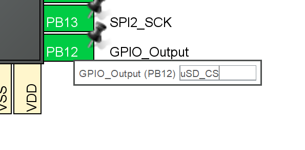
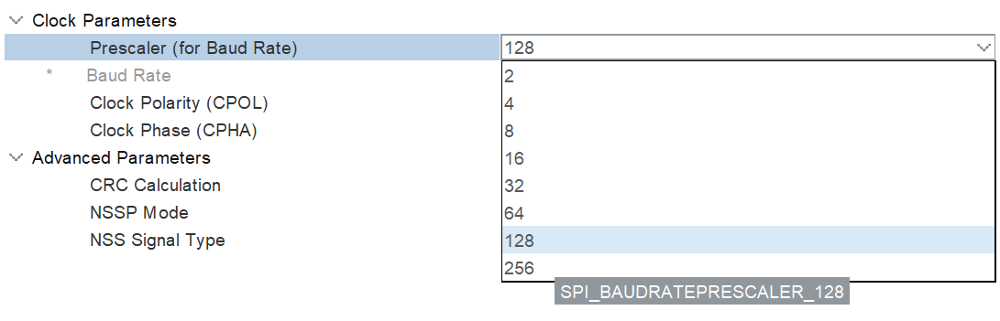
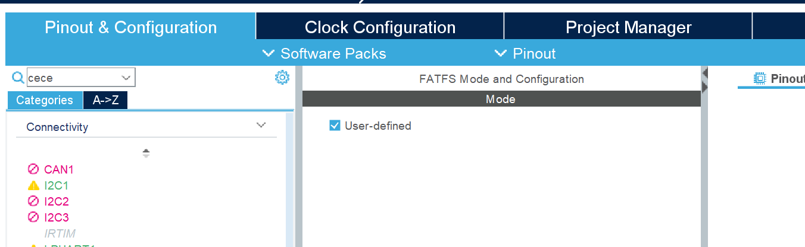

### Saving Data to A MicroSD Card

## Resources:
- Tutorial by kiwih: "Tutorial: An SD card over SPI using STM32CubeIDE and FatFS" https://01001000.xyz/2020-08-09-Tutorial-STM32CubeIDE-SD-card/.
- https://controllerstech.com/sd-card-using-spi-in-stm32/
- "SPI Signal Names" by SparkFun Electronics: https://www.sparkfun.com/spi_signal_names

## Required Software & Equipment
- BinarX Rocket Payload Microcontroller Board
- MicroSD Card
- STM32CubeIDE
- STLink STM32 Dubugger & Programmer

## Procedure

### Configure the SPI Hardware for operation with a MicroSD Card

SPI or serial peripheral interface is a common serial interface for connecting sensors and peripherals to a processor or two processors or controllers to each other. It's called a serial interface as the bits of information are sent one after another down a single line or single pair of lines (instead of bits alongside each other which would be called a parallel interface).

On our rocket payload microcontroller board, the SPI interface that is connected to the MicroSD card slot is ```SPI2```.


1. Configure the SPI2 periphral for "Full Duplex Controller" (formerly known as "Full Duplex Master") with no chip select ("CS") signal (sometimes formerly referred to as slave select, "SS" or "NSS")

    

   You can find an article explaining SPI signal names and why they have changed recently here if you are interested: https://www.sparkfun.com/spi_signal_names.

1. Set the "Data Size" to "8 bits":

    

1. Configure PB12 as a "GPIO Output" and give it the label "uSD_CS":

    

1. Set the prescaler to 128, which with the 16 MHz, HSE oscillator should give you a baud rate of 125 KBits/s:

    

1. Move over to the "Clock Configuration" tab, and click "Resolve Clock Issues" if needed.

1. In the left hand side, scroll down to "Middleware and Software Packs", click on FATFS:

    

    then enable it by ticking "User-defined" in the middle pane:

    

1. Save, and generate code.


