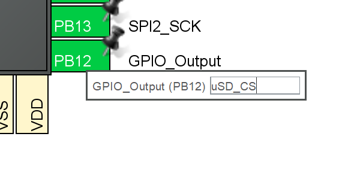

### Saving Data to A MicroSD Card

## Resources:
- Tutorial by kiwih: "Tutorial: An SD card over SPI using STM32CubeIDE and FatFS" https://01001000.xyz/2020-08-09-Tutorial-STM32CubeIDE-SD-card/.

## Required Software & Equipment
- BinarX Rocket Payload Microcontroller Board
- MicroSD Card
- STM32CubeIDE

## Procedure

1. Configure the SPI2 periphral for "Full Duplex Controller" (formerly known as "Full Duplex Master") with no chip select ("CS") signal (sometimes formerly referred to as slave select, "SS" or "NSS")

    

1. Set the "Data Size" to "8 bits":

    

1. Configure PB12 as a "GPIO Output" and give it the label "uSD_CS":

    

1. Set the prescaler to 128, which with the 16 MHz, HSE oscillator should give you a baud rate of 125 KBits/s:

    