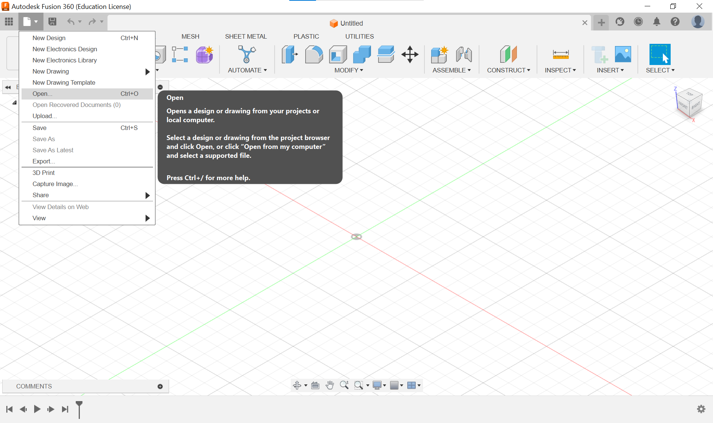
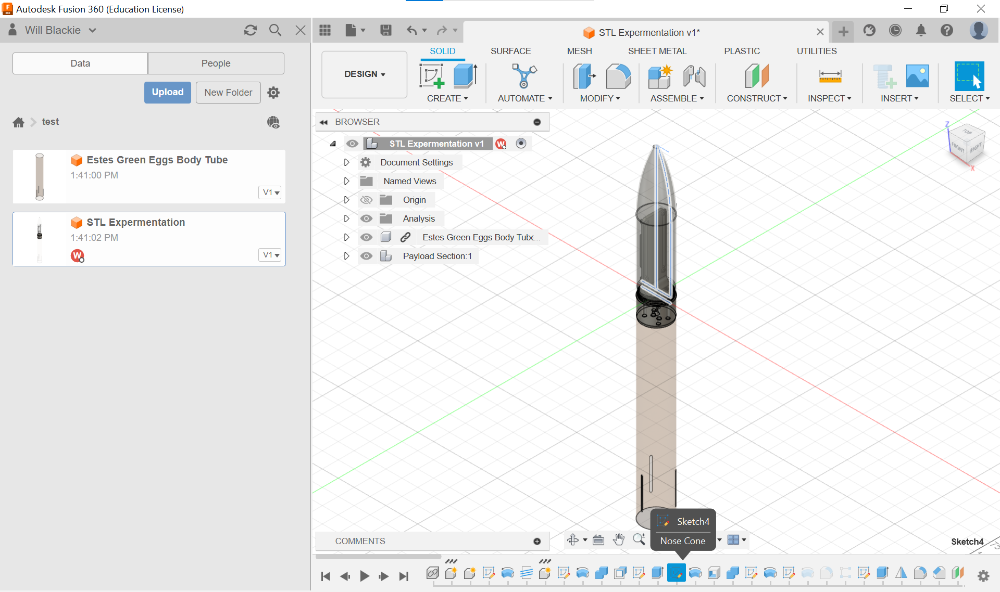
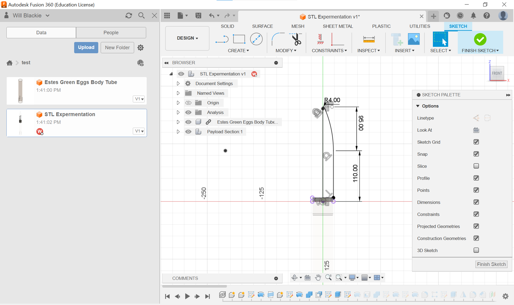

# Payload Section Design in 3D CAD <!-- omit from toc -->

### Table of Contents <!-- omit from toc -->
- [Objectives](#objectives)
- [Requirements](#requirements)
- [Resources](#resources)
- [Procedure](#procedure)
- [1.0 Fusion 360 Project Installation](#10-fusion-360-project-installation)
- [2.0 Nosecone Reshaping](#20-nosecone-reshaping)
- [3.0 Thread for insert](#30-thread-for-insert)
- [4.0 Adding STL files](#40-adding-stl-files)
- [5.0 Saving/Exporting as STL](#50-savingexporting-as-stl)
- [6.0 Creating custom supports for nosecone in PrusaSlicer](#60-creating-custom-supports-for-nosecone-in-prusaslicer)

## Objectives
1. Download and open existing Fusion 360 Project
1. Edit Nose Cone Shape
1. Add STL files to Fusion 360 
1. Export nosecone as STL
1. Add custom supports in PrusaSlicer
1. Adding threads to model

## Requirements
1. Fusion 360 installed on device
2. Fusion 360 Educational license set up

## Resources
- Fusion 360 self learning link: https://help.autodesk.com/view/fusion360/ENU/courses/
- Revolving Solid Bodies: https://help.autodesk.com/view/fusion360/ENU/?guid=GUID-D74BB28A-9570-43AD-97A4-E094021C036B
- Insert STL file into Fusion 360: https://www.autodesk.com/support/technical/article/caas/sfdcarticles/sfdcarticles/How-to-insert-a-mesh-body-into-Fusion-360.html
- Exporting as STL from Fusion 360: https://www.autodesk.com/support/technical/article/caas/sfdcarticles/sfdcarticles/How-to-export-an-STL-file-from-Fusion-360.html
- PrusaSlicer custom support guide: https://help.prusa3d.com/article/modifier-meshes-custom-supports-and-other-magic_114258

## Procedure

## 1.0 Fusion 360 Project Installation

1. Download the project attached to the github lesson named "nosecone.f3z"

1. Open Fusion 360 and click on the file button -> open

1. Open from my computer then find and select the downloaded .f3z file

1. Now that were are on the file it is best to check "Fusion 360 self learning link" to get an understanding of how to navigate the program.

## 2.0 Nosecone Reshaping

1. scroll through the timeline and find sketch 4: 

1. Double click the sketch to bring up the editor

### Sectional Analysis <!-- omit from toc -->

1. We need to ensure that our new nosecone fits with the payload. To ensure this we use the sectional analysis tool.

<!---->

2. Move the arrow up and down to check if there is any intersection between the payload and the nosecone.

<!-- -->

If there are no intersections we've successfully changed our nosecone shape!

## 3.0 Thread for insert

TBD if we use this section

## 4.0 Adding STL files

1. Refer to the [Insert STL file into Fusion 360](https://www.autodesk.com/support/technical/article/caas/sfdcarticles/sfdcarticles/How-to-insert-a-mesh-body-into-Fusion-360.html) resource to insert STL models into the project.
   Use 3D model resources like [Thingiverse](https://www.thingiverse.com/) to add decorative STL models to the nosecone.

   **NOTE: Follow part 2's sectional analysis to ensure that the model doesnt clash with the payload and that the STL is securely connected to the nose cone**

1. STL nosecone implementations below:

    Nosecone with frogs

    

## 5.0 Saving/Exporting as STL

1. Use the guide to [Exporting as STL from Fusion 360](https://www.autodesk.com/support/technical/article/caas/sfdcarticles/sfdcarticles/How-to-export-an-STL-file-from-Fusion-360.html) resource provided to export the nosecone file as an STL ready to be used on the slicer. Focus on "Use the Export function" section of the guide.

1. Place STL file on USB? ready for slicing.

## 6.0 Creating custom supports for nosecone in PrusaSlicer

1. What are supports and why are they used in 3D printing?
   - The main reason for supports is to **Support Overhangs** as 3D printing with the (Prusa MK3?) is an additive process meaning it builds upon the lower layers slowly climbing up the nosecone. This means that if there are any overhangs they would be printed in mid air and due to gravity plummet onto the print bed which isn't what we're after. Therefore, support allows for parts to build out and up without any other part of the model beneath them.
   - **Improving Print Quality** by supporting overhangs it allows for the print to have a smoother more accurate finish as it prevents drooping of filament during printing.
   - lastly, support can **Prevent Print Failures** as it stabilizes the structure, reducing the risk of parts moving or becoming detached from the bed during printing.

1. Using the PrusaSlicer we're able to create custom supports which allow us to be selective with out placement, density, patterns, and configuration options to ensure the print is what we expect from a prototype rocket nosecone.

1. The [PrusaSlicer custom support guide](https://help.prusa3d.com/article/modifier-meshes-custom-supports-and-other-magic_114258) outlines the potential of custom supports.
    Request the tutors computer or use your own device to add custom supports to the decorations added.

