# Payload Section Design in 3D CAD <!-- omit from toc -->

### Table of Contents <!-- omit from toc -->
- [Objectives](#objectives)
- [Requirements](#requirements)
- [Resources](#resources)
- [Procedure](#procedure)
- [1.0 Fusion 360 Project Installation](#10-fusion-360-project-installation)
- [2.0 Nose Cone Reshaping](#20-nose-cone-reshaping)
- [3.0 Adding STL Files](#30-adding-stl-files)
- [4.0 Saving/Exporting as STL](#40-savingexporting-as-stl)
- [5.0 Creating Custom Supports for Nose Cone in PrusaSlicer](#50-creating-custom-supports-for-nose-cone-in-prusaslicer)
- [6.0 EXTENSION: Thread Nose Cone for Insert](#60-extension-thread-nose-cone-for-insert)

## Objectives
1. Download and open existing Fusion 360 Project
1. Edit Nose Cone Shape
1. Add STL files to Fusion 360 
1. Export nose cone as STL
1. Add custom supports in PrusaSlicer
1. Adding threads to model

## Requirements
1. Fusion 360 installed on device
2. Fusion 360 Educational license set up

## Resources
- Fusion 360 self learning link: https://help.autodesk.com/view/fusion360/ENU/courses/
- Revolving Solid Bodies: https://help.autodesk.com/view/fusion360/ENU/?guid=GUID-D74BB28A-9570-43AD-97A4-E094021C036B
- Insert STL file into Fusion 360: https://www.autodesk.com/support/technical/article/caas/sfdcarticles/sfdcarticles/How-to-insert-a-mesh-body-into-Fusion-360.html
- Exporting as STL from Fusion 360: https://www.autodesk.com/support/technical/article/caas/sfdcarticles/sfdcarticles/How-to-export-an-STL-file-from-Fusion-360.html
- PrusaSlicer custom support guide: https://help.prusa3d.com/article/modifier-meshes-custom-supports-and-other-magic_114258

## Procedure

**Basic Actions**
| Action  |             Shortcut |
| :------ | -------------------: |
| pan     |  middle mouse button |
| revolve | shift + middle mouse |
| zoom    |         scroll wheel |

## 1.0 Fusion 360 Project Installation

1. Download the project attached to the github lesson named "Green Eggs Rocket with Simplified Payload Section v63.f3z"

1. Create a new project. 
   
   Goto Data panel:

   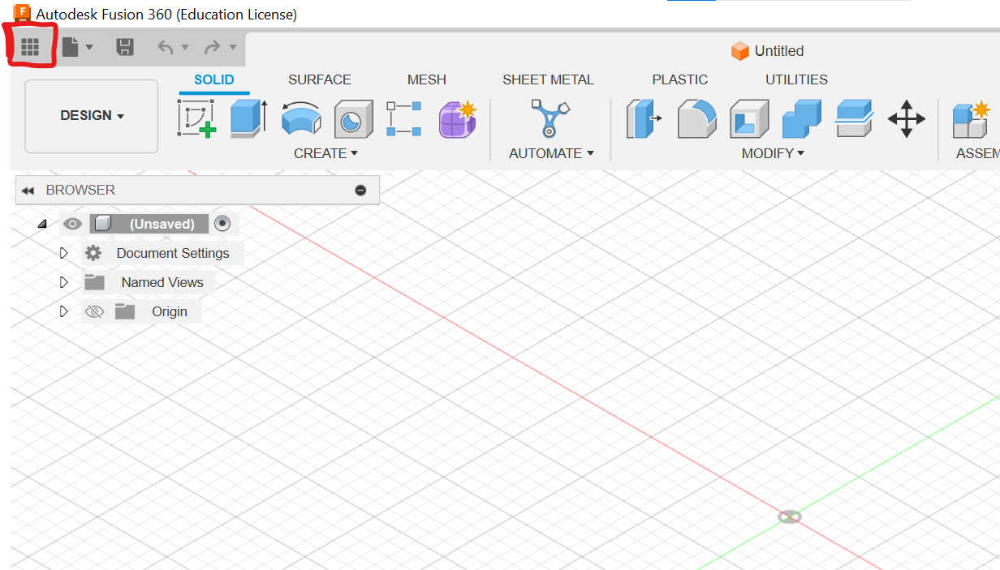

1. Click new project.
   
   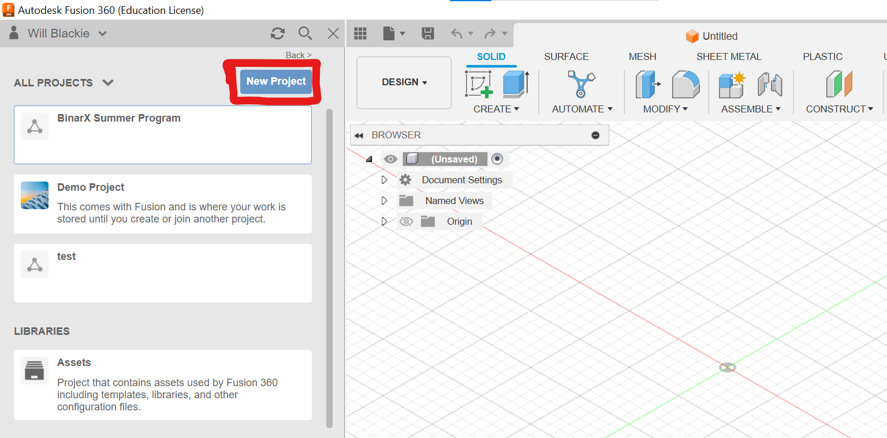

1. Title the project something meaningful, click enter and open the project. 

   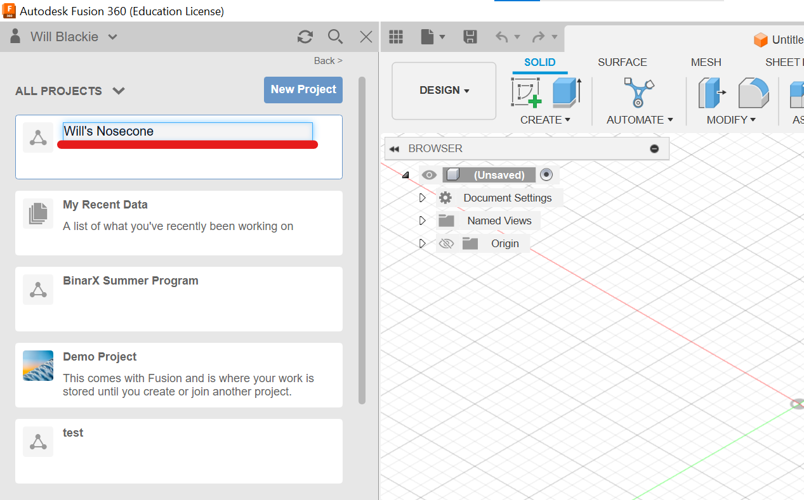

1. Open Fusion 360 and click on the file button -> open

   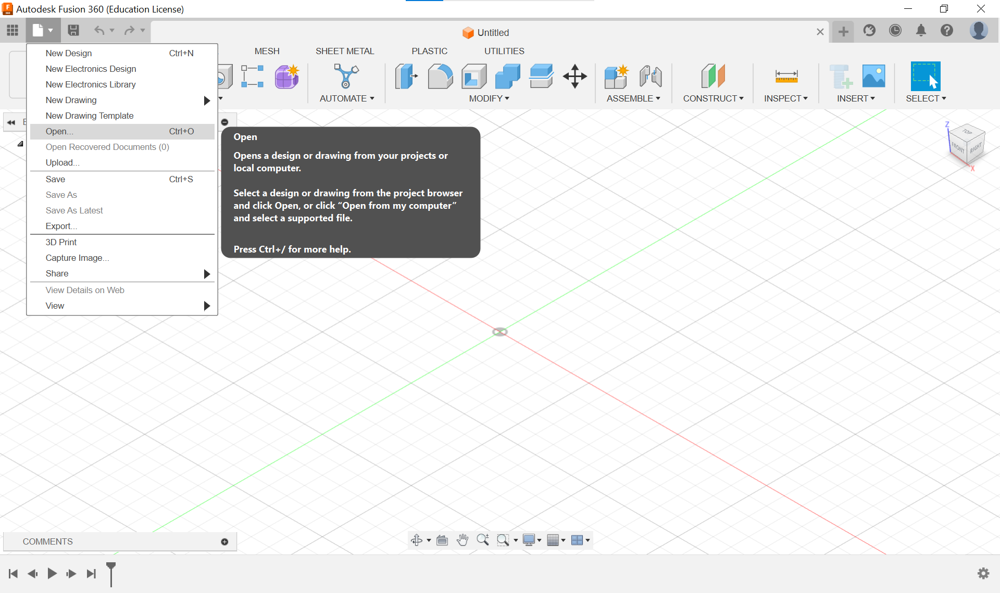

1. Open from my computer then find and select the downloaded .f3z file

   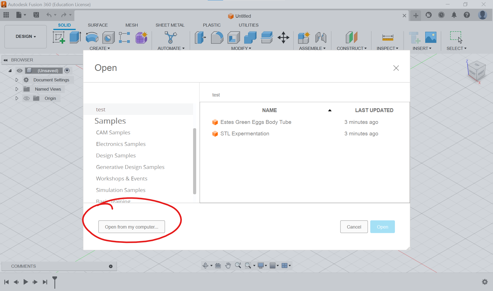

1. Now that were are on the file it is best to check "Fusion 360 self learning link" to get an understanding of how to navigate the program.

## 2.0 Nose Cone Reshaping

**Sketch Shortcuts**
| Action          | Shortcut |
| :-------------- | -------: |
| line            |        l |
| dimension       |        d |
| rectangle       |        r |
| trim            |        t |
| circle (centre) |        c |

1. scroll through the timeline and find sketch 4 (Nose Cone): 
   
   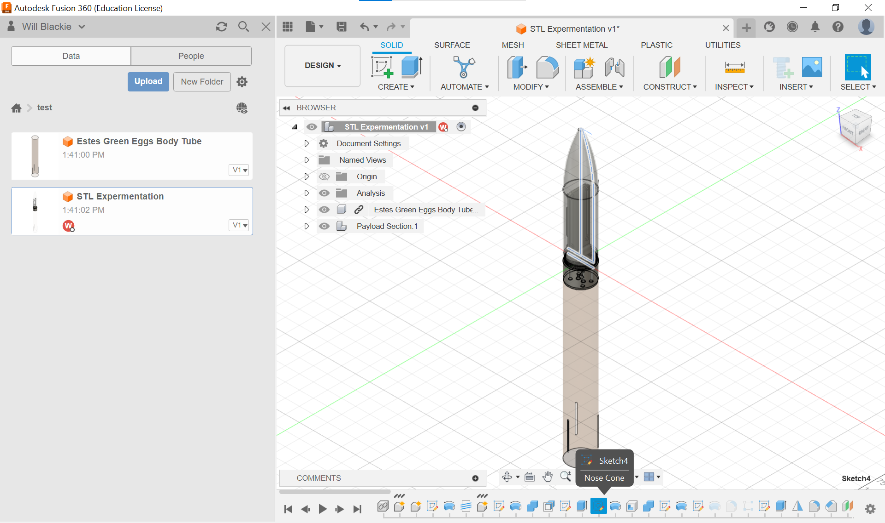

2. Double click the sketch to bring up the editor
   
   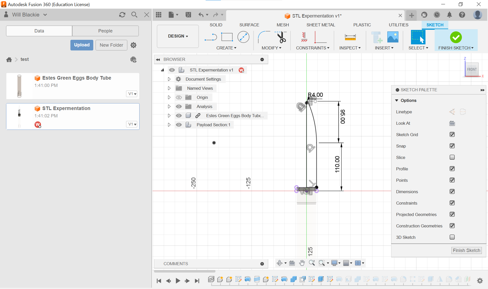

3. Click on the dimensions to change the sizes. 

   To be more creative with the shape you can edit the sketch refering to the [sketch guide!](https://help.autodesk.com/view/fusion360/ENU/?guid=GUID-91E892FC-BE5D-4AAB-A823-61BFF7A7B663)
   
   **NOTE: the lines have to be black to show that they're fully constrained**

### Sectional Analysis <!-- omit from toc -->

1. We need to ensure that our new nose cone fits with the payload. To ensure this we use the sectional analysis tool.

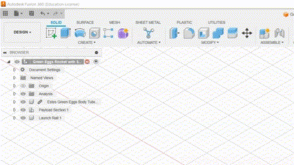

1. Move the arrow up and down to check if there is any intersection between the payload and the nose cone.

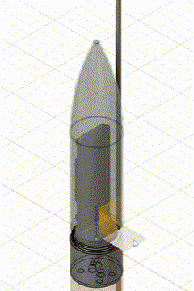

If there are no intersections we've successfully changed our nose cone shape!

## 3.0 Adding STL Files

**Mesh Shortcuts**
| Action  | Shortcut |
| :------ | -------: |
| move    |        m |
| measure |        i |

1. Refer to the [Insert STL file into Fusion 360](https://www.autodesk.com/support/technical/article/caas/sfdcarticles/sfdcarticles/How-to-insert-a-mesh-body-into-Fusion-360.html) resource to insert STL models into the project.
   Use 3D model resources like [Thingiverse](https://www.thingiverse.com/) to add decorative STL models to the nose cone.

   **NOTE: Follow part 2's sectional analysis to ensure that the model doesn't clash with the payload and that the STL is securely connected to the nose cone**

2. Remesh the newly added mesh, reducing the amount of faces on complex models.

   Adjust the density and shape preservation until the mesh has a reduced amount of faces (the lower the number the faces the better the performance of Fusion360 and the printer only has an accuracy of 0.4mm)

   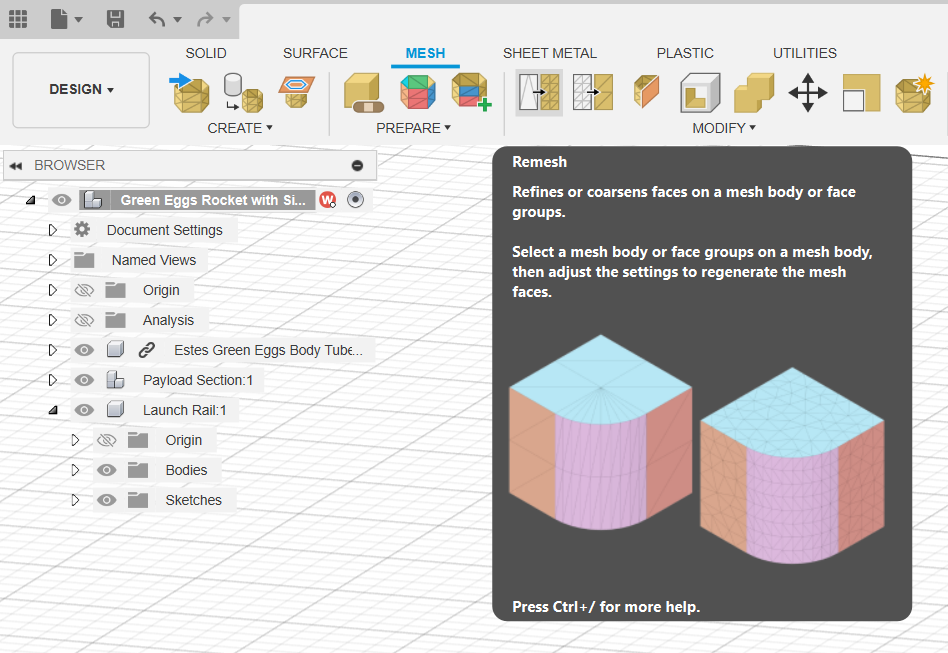

   An example of parameters that helped me add a frog to the payload are below.

   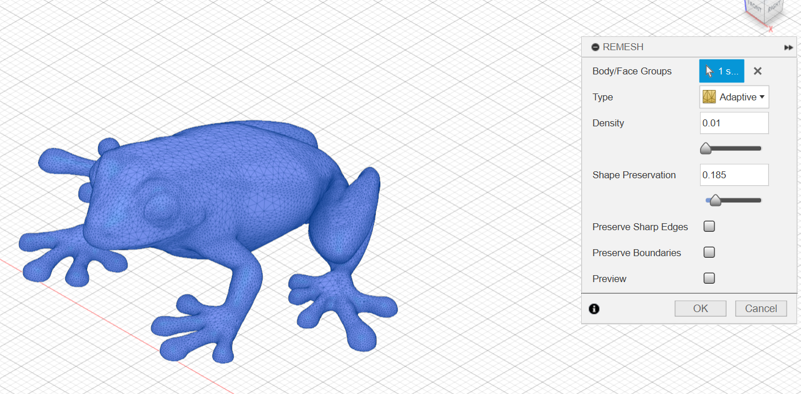

3. Reduce the size of the mesh to also increase the performance of Fusion360 and avoid warnings.

   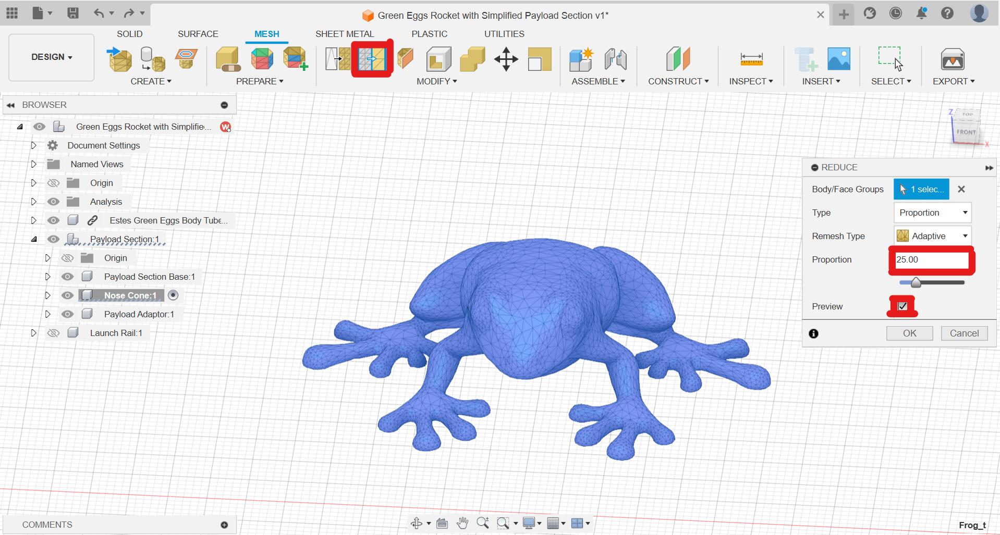

4. Convert the mesh to a body using the convert mesh function, this will take significantly longer if the number of faces is too large.

   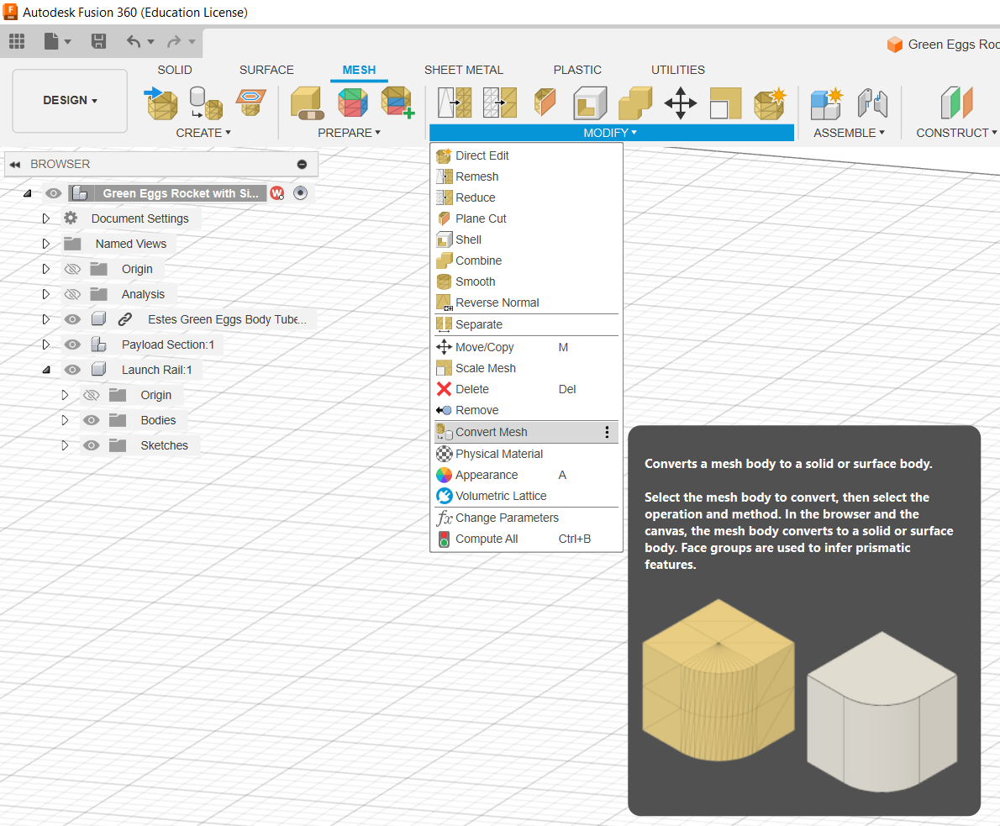

5. STL nose cone implementations below:

    Nose cone with frog

    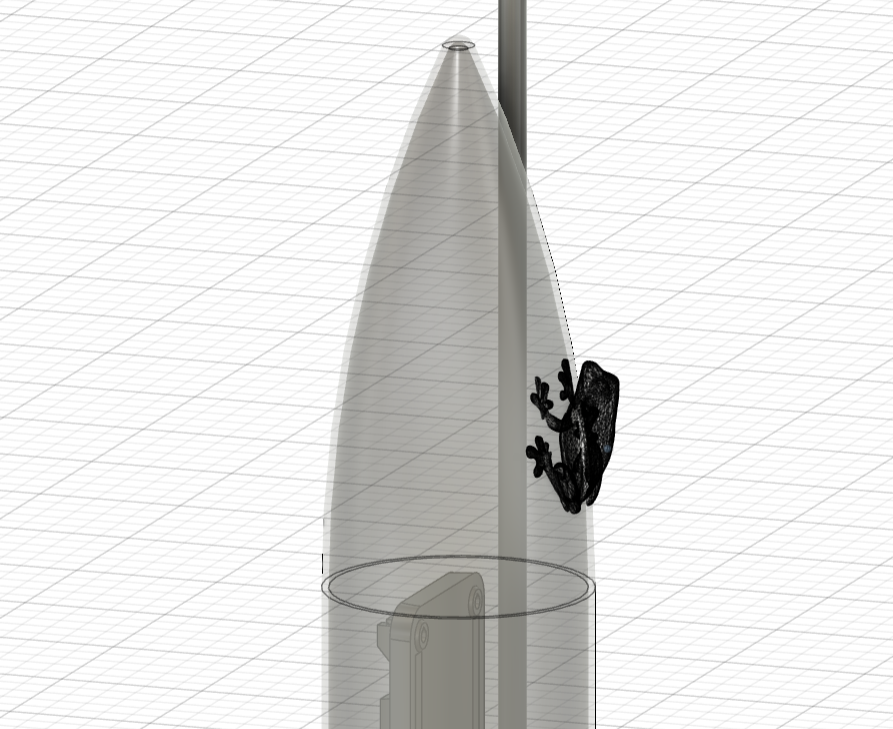

## 4.0 Saving/Exporting as STL

1. Use the guide to [Exporting as STL from Fusion 360](https://www.autodesk.com/support/technical/article/caas/sfdcarticles/sfdcarticles/How-to-export-an-STL-file-from-Fusion-360.html) resource provided to export the nose cone file as an STL ready to be used on the slicer. Focus on "Use the Export function" section of the guide.

1. Place STL file on USB? ready for slicing.

## 5.0 Creating Custom Supports for Nose Cone in PrusaSlicer

1. What are supports and why are they used in 3D printing?
   - The main reason for supports is to **Support Overhangs** as 3D printing with the (Prusa MK3?) is an additive process meaning it builds upon the lower layers slowly climbing up the nose cone. This means that if there are any overhangs they would be printed in mid air and due to gravity plummet onto the print bed which isn't what we're after. Therefore, support allows for parts to build out and up without any other part of the model beneath them.
   - **Improving Print Quality** by supporting overhangs it allows for the print to have a smoother more accurate finish as it prevents drooping of filament during printing.
   - lastly, support can **Prevent Print Failures** as it stabilizes the structure, reducing the risk of parts moving or becoming detached from the bed during printing.

1. Using the PrusaSlicer we're able to create custom supports which allow us to be selective with out placement, density, patterns, and configuration options to ensure the print is what we expect from a prototype rocket nose cone.

1. The [PrusaSlicer custom support guide](https://help.prusa3d.com/article/modifier-meshes-custom-supports-and-other-magic_114258) outlines the potential of custom supports.
    Request the tutors computer or use your own device to add custom supports to the decorations added.

## 6.0 EXTENSION: Thread Nose Cone for Insert

With the assistance of the lab staff attempt to complete the threading step following [this guide.](https://www.autodesk.com/products/fusion-360/blog/how-to-create-threads-in-fusion-360/)

**NOTE: The thread size may be of irregular size which will require a surface offset for tolerance reasons.**

