# ADXL326 Lesson Plan

### Table of Contents
- [Objectives](#objectives)
- [Requirements](#requirements)
- [Resources](#resources)
- [Procedure](#procedure)

## Objectives
1. Understand the component.
2. Design a circuit to use the ADXL326.
3. Breadboard the circuit for testing.
4. Devlop code to test the circuit.
5. Transfer the final working design on the payload kit.
6. Interpret the results output by the code.

## Requirements
1. Understanding of CubeMX environment.
2. Datasheet for ADXL326.
3. Datasheet for STM32L433xx.

## Resources
- ADXL326 Datasheet: https://www.analog.com/media/en/technical-documentation/data-sheets/ADXL326.pdf
- STM32L433CBT7 Datasheet: https://au.mouser.com/datasheet/2/389/stm32l433cc-1696557.pdf
- Coding in STM32CubeIDE: https://wiki.st.com/stm32mcu/wiki/STM32StepByStep:Getting_started_with_STM32_:_STM32_step_by_step
- The basics on capacitors: https://www.matsusada.com/column/capacitor.html 

## Procedure

### 1. Understanding the component
1. Review the "functional block diagram" for the ADXL326. How many inputs does the chip have? How many outputs does the circuit have?
        <details>
        <summary>**The functional block diagram**</summary>
        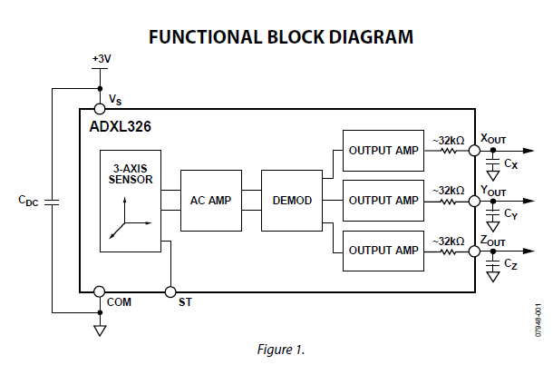
            <details>
            <summary>**Answers**</summary>
            <br>
            The chip has 3 inputs: a +3 Volts input, a connection to ground (COM) and a self test trigger (ST).<br>The chip has 3 outputs: an X direction value, a Y direction value and a Z direction value.
            </details>
        </details>
<br>

2. Review the "pin configuration and function descriptions" diagram and table. What are the important requirements for the input pins? Notice how the X, Y, and Z axes are denoted on the diagram (would be wise to keep a note of this).
        <details>
        <summary>**The pin configuration and function descriptions diagram**</summary>
        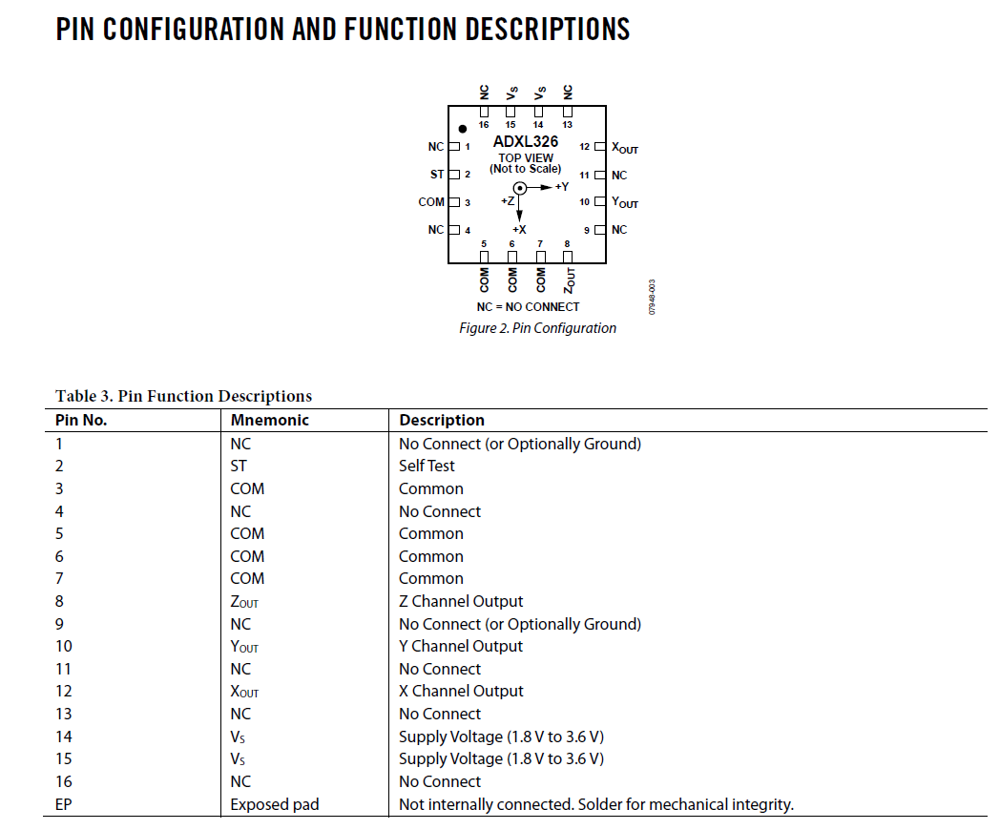
            <details>
            <summary>**Answers**</summary>
            <br>
            The chip can only be supplied a voltage between 1.8 and 3.6 Volts. It is always important to check the maximum ratings that can be applied to any component you are dealing with. In our case, we know we will be supplying a voltage of 3 volts, so we will not be supplying more voltage than the component can handle.
            </details>
        </details>
<br>

3. Further details you will need to consider later on in the devlopment of code and testing of the component can be found in the specifcations table in the data sheet for the ADXL326. You can refer to this table later, to help tune your code that will run the ADXL326.
        <details>
        <summary>**Specifications table**</summary>
        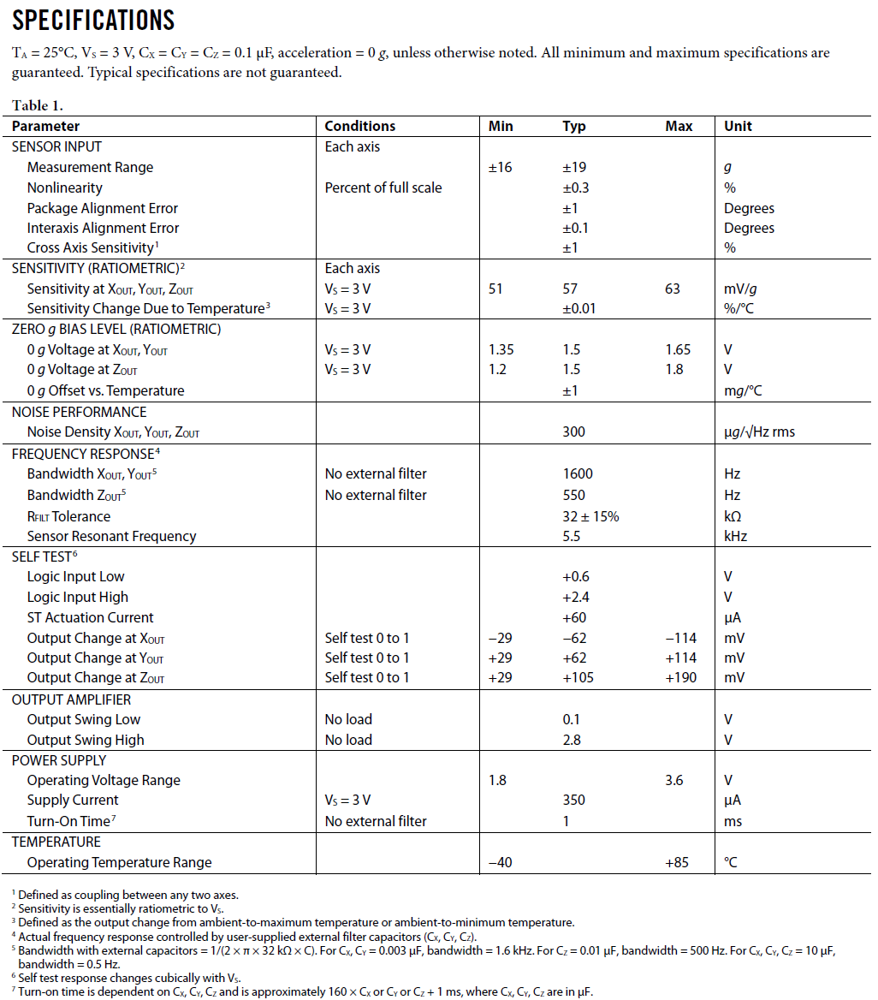
        </details>
<br>

### 2. Designing the circuit for ADXL326
1. Keeping the requirements for the ADXL326 in mind, what do we need from the microcontroller? What do we need to send to the microcontroller?
        <details>
        <summary>**Answers**</summary>
        <br>
        -The microcontroller will need to supply 3 volts and a ground to the ADXL326. Remember, the chip is expecting these inputs. You may also want to consider that the chip can also be supplied a self test signal, which is another input that the microcontroller will need to handle.<br><br>- The microcontroller needs to take in three analog readings from the ADXL326. These are the voltages the chip outputs for the X, Y and Z directions. You will need to handle these inputs via the microcontroller. Note these signals are analog in nature and the microcontroller will need to handle this.
        </details>
<br>

2. Referring to the microcontroller pinout, you will need to select the correct pins to use for these inputs and outputs. Think about what type of signal these inputs and outputs are, are they a digital or analog signal?
        <details>
        <summary>**Microcontroller I/O Pinout**</summary>
        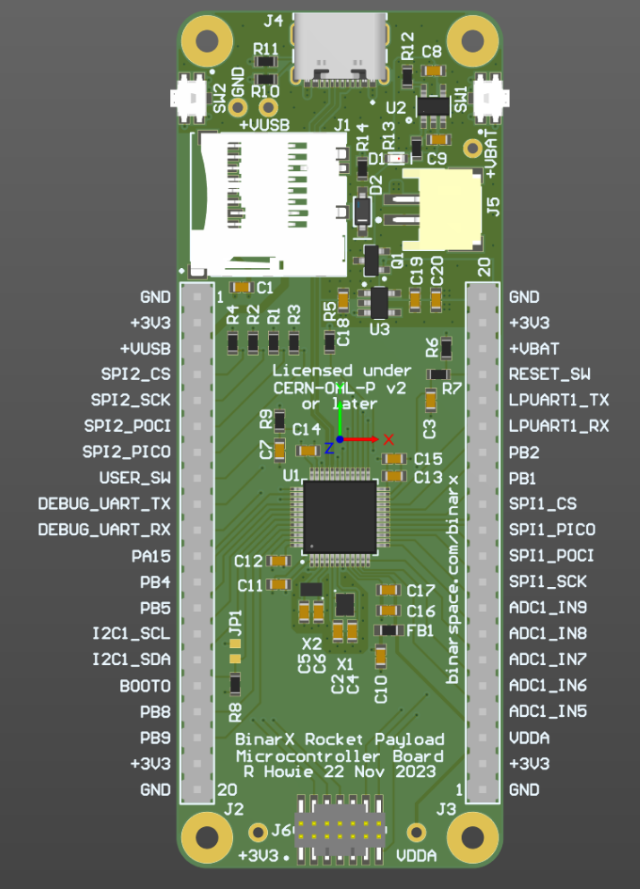
        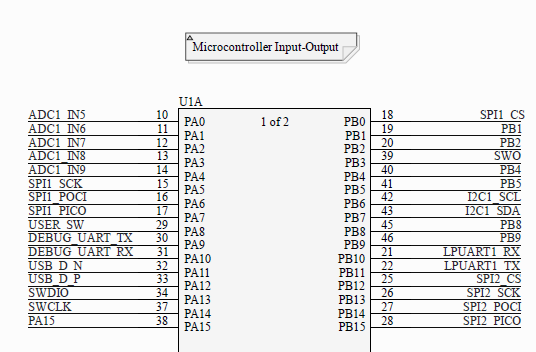
            <details>
            <summary>**Answers**</summary>
            <br>
            - Looking at the specifcations document for the ADXL326, we can see the outputs for the X, Y, and Z channels are an analog voltage signal (i.e not a discrete 0 or 1). Hence, we know we have to select pins capable of using the analog to digital converter (ADC). This will allow the microcontroller to interpret the analog voltage signals as a digital value. Meaning, the only avaliable pins are PA0 to PA4. These are the ADC1_IN5 to ADC1_IN9 pins.<br><br>- The inputs for the ADXL326 are much more simple, you'll need to connect the COM pin to the GND pin on the microcontroller. You'll then need to connect the +3V pin to the +3V3 supply on the microcontroller.<br><br>- Also consider the use of a general input/output pin for the self-test option. You could use any of the free pins, for example PB1, or PB2.
            </details>
        </details>
<br>

3. Draw a circuit of your proposed solution. Does it meet the requirements of the ADXL326? Check it against the below example diagrams. To ensure that the chip has a constant and steady supply of power, what passive electronic component should be used?
        <details>
        <summary>**Answers**</summary>
        Your proposed solution should look something like this:
        
                <details>
                <summary>**Important Tips**</summary>
                <br>
                - Notice how IN8 has been used instead of IN7 for the ADC. This is because later on the PA2 pin (or ADC1_IN7) will be utilised by another subsystem on the chip. This will be made clearer on task 4.3, where the USART system onboard the microcontroller is turned on. This will save time later.<br><br>- A capacitor is used between ground and supply voltage to smooth our any voltage drops from the microcontroller. As the device needs to power itself and supply power to other logical outputs, the power it outputs can fluctuate. Adding a capacitor is a common passive component that is capable of storing electrical charge and discharge when less power is being supplied. This allows the circuit to operate at a steady and constant voltage.<br><br>- It also means that noisy signals can be smoothed out. This is because capacitors suck up voltage, meaning they can take out large peaks in signals. However, if the signal starts to lessen in voltage they will start to supply voltage. This hence produces a signal that is smoother, because the peaks and troughs are brought closer together.
                </details>
        </details>
<br>

### 3. Breadboarding the circuit
1. Following your checked circuit diagram, connect all the components together on a breadboard.
<br>

2. Double check all your connections before proceeding to the next task. Verify with a subject matter expert if needed.
<br>

### 4. Setting up the STM32 environment for the STM32L433CBT7
1. You will now need to setup the an STM32cubeIDE project to interface with the ADXL326 using the payload development board. This board utilises the STM32L433CBT7 microcontroller. To verify this, you can read the writing on the top of the chip in the centre of the board.
<br>

2. First you'll need to open up STM32cubeIDE and start a new project:<br>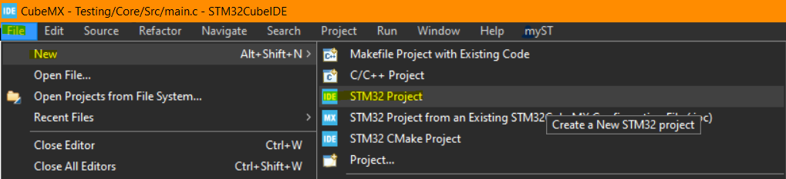
<br>

3. You'll need to select the correct board next. The microcontroller onboard the payload development kit is a 'STM32L433CBT7'. Once you have found the correct board, click 'Next'.<br>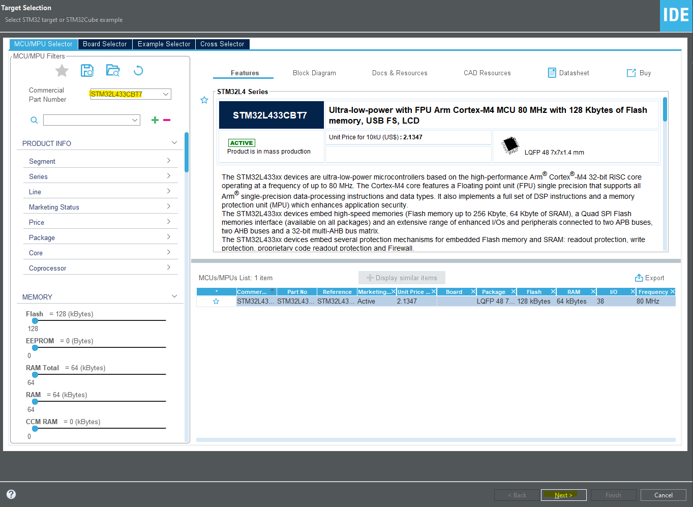
<br>

4. Next you can name the project what you would like, and select the C++ programming language option. Then you can select finish.<br>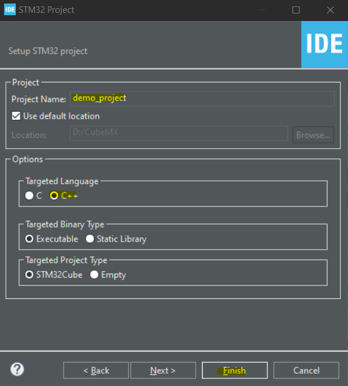
<br>

5. You will then be presented with the pinout for the microcontroller you'll be running! This gives you direct control over the capabilites the chip will have initialised.<br>The most important thing to set up is the ability to talk to the microcontroller, we need to tell the code how to communicate with the chip. For this we will select the 'system core' tab, then the 'SYS' tab where we will select the 'Serial Wire' option for debugging. This tells the chip what method of communication we will be using for debugging the chip.<br>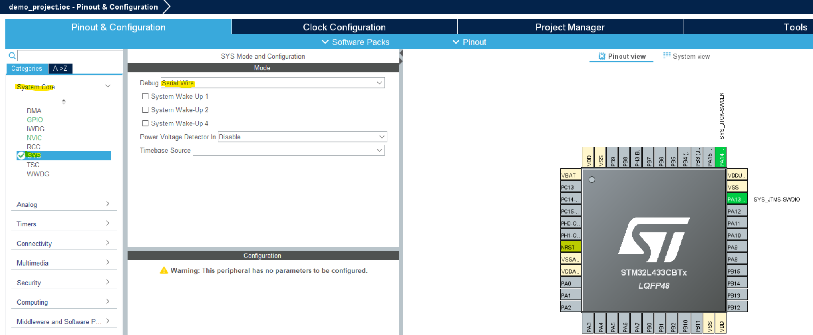
<br>

6. Next, we need to let the chip know how it will be flashed. For this we will select the 'Connectivity' tab, then the 'USART2' tab where you'll select the mode as 'Asynchronous'. This is letting the microcontroller know we will be using the USART2 pins to communicate from the laptop to the microcontroller.<br>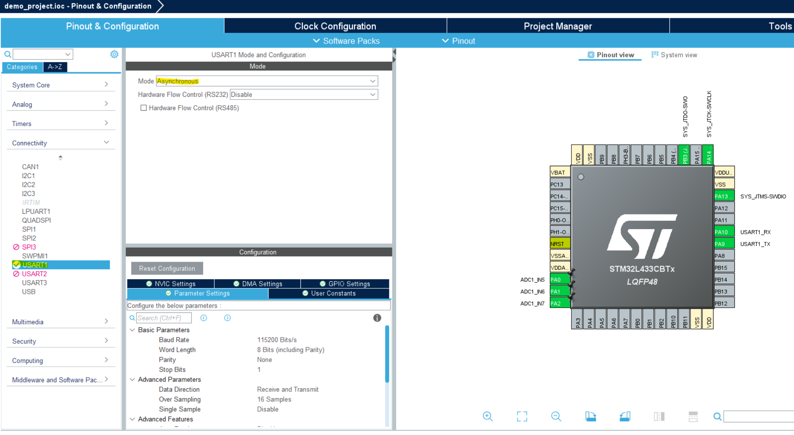
<br>

7. As we have three *analog* inputs, we know we have to initilise the ADC. To do this go to the 'Analog' tab, select the 'ADC1' tab and chose the same pins you have marked down in your circuit diagram. Here you may notice the yellow and pink highlighted options.<br>The yellow is saying that selecting this pin will limit the options available to other currently active peripheries.<br>The pink is saying that this pin is being limited by other currently active peripheries.<br>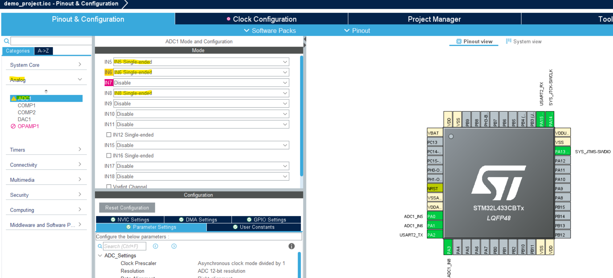
<br> 

8. Because we have three seperate data lines going into one ADC, we need to set up a method of polling all the values from the ADC at once. First, we need to let the ADC know there are three converions occuring. This setting can be found in the "Configuration" window and the value you need to change is the "Number Of Conversion".<br>After this, you'll need to allocate the different ADC channels to the generated "Rank" settings. This is detailed in the image bellow.<br>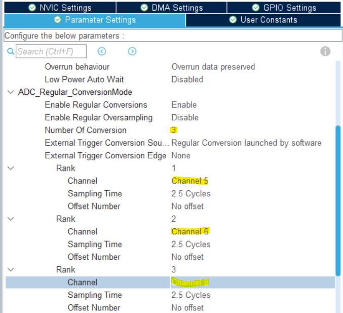
<br>

9.  Next, we need to change the Direct Memory Access settings (DMA settings) by adding a DMA request for ADC1.<br>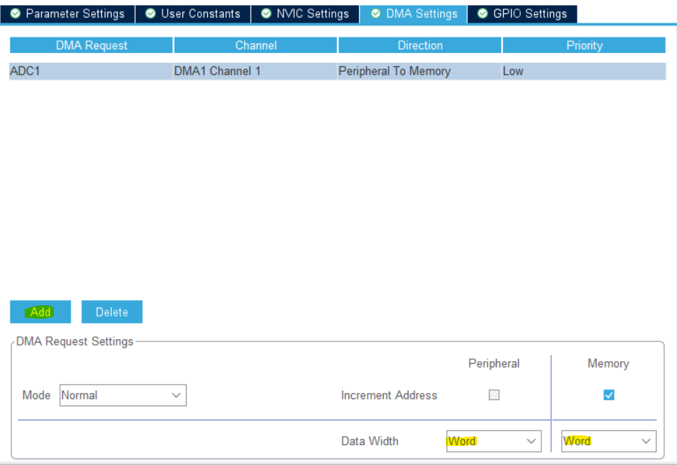
        <details>
        <summary>**What is DMA?**</summary>
        <br>
        Direct Memory Access bypasses the need for the data to be handled through the CPU. This means that the data the ADC generates is sent directly to memory, which can then be accessed straight away by the CPU for use in the flashed code on the microcontroller.
        </details>
<br>

10. Finally, we need to go back to 'Parameter Settings' and ensure the following continous conversion settings are selected:<br>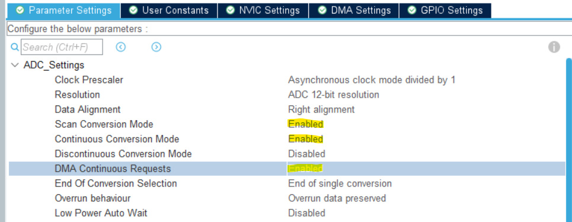
<br>

11. Now all the ADC settings are selected, we need to adjust the clock settings. Go to the 'Clock Configuration' tab and select 'Yes' on the prompt asking to run the automatic clock solver. This will solve all our problems for us. If this does not work, click the 'Resolve Clock Issues' button.<br>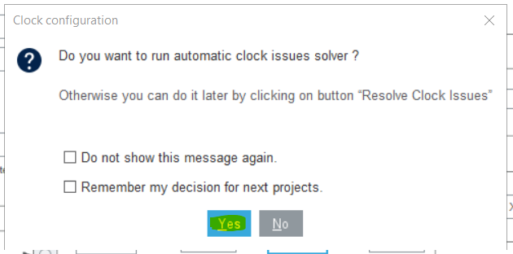
        <details>
        <summary>**Why is this?**</summary>
        The ADC onboard the microcontroller cannot continuiously converted the voltages outputted by the ADXL326. This is because the microcontroller operates in discrete time, meaning its components are told when to process information and at what rate by clocks on the board. These clocks can be configured however, to allowing the user to set the polling rate of the ADC to match the data rate of the sensor that provides analog values. Hence, when we configure the ADC1 pins in cubeIDE, it must be updated. For the ADXL326, it does not have a specific data production rate (you'll notice nothing is mentioned in the specifications from task 1.3)
        </details>
<br>

12. Now "ctl + s" to save the configuration. It will then ask you if you would like to generate code, select 'Yes'. It will then ask if you would like the C/C++ perspective, select 'Yes' again.

### 5. Writing the code
1. Now all the necessary initialisation has been taken care of its time to start adding in the code that will pull data from the ADC. To do this though, you must first understand that if any changes are made in the chip configuration page (where all the tasks in section 4 took place) the code will be regenerated. To stop any code you add to the main.c file from being over written you **must** put it in the correct place. These spots for use code are denoted as follows:<br>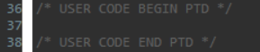
<br>

2. First of all we must include the required header files for the project. As we will be using integers, I/O, and strings, the following header files have been used:
<br>
```C++
/*USER CODE BEGIN Includes*/
#include "stdio.h"
#include "stdint.h"
#include "string.h"
/*USER CODE END Includes*/
```

3. Next we need a variable that is capable of holding three numbers. We also need a buffer variable that can store the data for it to be transmitted over UART for debugging.
<br>
        <details>
        <summary>**Why is it a 32 bit integer?**</summary>
        <br> 
        After reading the ADC HAL functions it was found that they all utilise 32 bit integers. Though the ADC is a 12 bit ADC, it seems that the ADC is able to output 32 bit numbers. Here is an interesting thread that discusses it: https://stackoverflow.com/questions/76127376/stm32-why-does-hal-adc-start-dma-want-data-buffer-to-be-cast-as-uint32-t
        </details>
```C++
/*USER CODE BEGIN 0*/
uint32_t ADC_Values[3];
uint8_t Print_Buffer[50];
/*USER CODE END 0*/
```

4. Now we need to start the DMA request capabilities. This is a one time initialisation, however, it needs to be run after the DMA is initialised. This function takes the memory address of the ADC handler, the ADC values variable you created and the number of channels the DMA needs to access.<br>The handler for the ADC is automatically generated by the setup we did in section 4, and can be found around line 51.
<br>
```C++
/*USER CODE BEGIN 2*/
HAL_ADC_Start_DMA(&hadc, ADC_Values, 3);
/*USER CODE END 2*/
```

5. Now to actually utilise the variables we need to write the below code. Here is purely a diagnostic tool, to verify the ADXL326 is working and you are able to read from it correctly.
<br>
```C++
/* USER CODE BEGIN WHILE */
while(1)
{
        sprintf((char *)test_buffer, "C1: %d C2: %d C3: %d\r\n", (int)value[0], (int)value[1], (int)value[2]);
        HAL_UART_Transmit(&huart2, test_buffer, 50, 10);
        HAL_Delay(500);
}
```

6. NOW WE NEED TO WRITE IT TO AN SD CARD AND MAKE SURE IT BEHAVES AS EXPECTED.

### 6. Transferring the circuit to the payload kit
1. Now transfer the accelerometer to the payload development kit. Keeping in mind the direction of the accelerometer, as you will need to adjust your code to account for another axes to now be resisting the effects of gravity.
<br>

2. Once the circuit has been correctly transferred to the development kit, you will need to adjust and retest the code you previous developed in task 4.4. 
<br>

### 7. Interpretting the results from the code
1. Once you have recoreded the raw data from the payload you will need to think of a way to convert the raw ninary numbers into Gs. Note the accelerometer should read between +/- 16Gs.