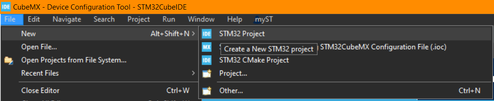
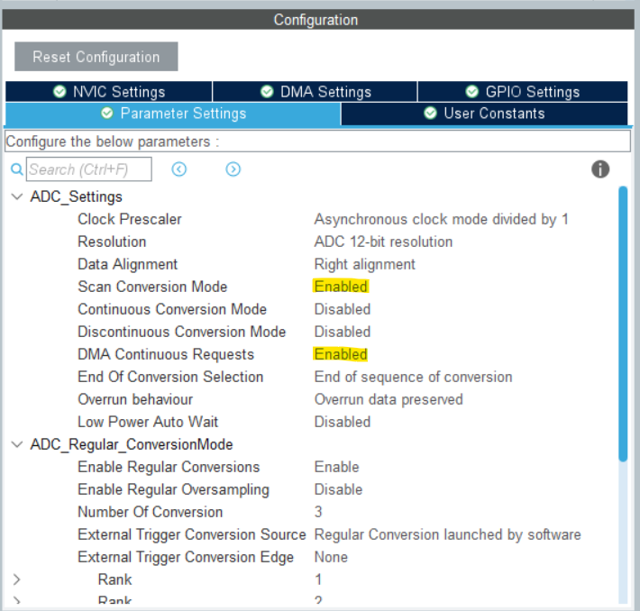

# ADXL326 Lesson Plan

### Table of Contents   <!-- omit from toc -->
- [ADXL326 Lesson Plan](#adxl326-lesson-plan)
  - [Objectives](#objectives)
  - [Requirements](#requirements)
  - [Resources](#resources)
  - [Procedure](#procedure)
    - [1. Understanding the component](#1-understanding-the-component)
    - [2. Designing the circuit for ADXL326](#2-designing-the-circuit-for-adxl326)
    - [3. Breadboarding the circuit](#3-breadboarding-the-circuit)
    - [4. Setting up the STM32 environment for the STM32L433CBT7](#4-setting-up-the-stm32-environment-for-the-stm32l433cbt7)
    - [5. Writing the code](#5-writing-the-code)
    - [6. Transferring the circuit to the payload kit](#6-transferring-the-circuit-to-the-payload-kit)

## Objectives
1. Understand the components.
2. Design a circuit to use the ADXL326.
3. Breadboard the circuit for testing.
4. Devlop code to test the circuit.
5. Transfer the final working design on the payload kit.
6. Interpret the results output by the code.

## Requirements
1. Understanding of CubeMX environment.
2. Datasheet for ADXL326.
3. Datasheet for STM32L433xx.
4. STM32L4 microcontroller board
5. USB-A to USB-C cable

## Resources
- ADXL326 Datasheet: https://www.analog.com/media/en/technical-documentation/data-sheets/ADXL326.pdf
- STM32L433CBT7 Datasheet: https://au.mouser.com/datasheet/2/389/stm32l433cc-1696557.pdf
- Coding in STM32CubeIDE: https://wiki.st.com/stm32mcu/wiki/STM32StepByStep:Getting_started_with_STM32_:_STM32_step_by_step
- The basics on capacitors: https://www.matsusada.com/column/capacitor.html 
- What is an ISR? https://www.makeuseof.com/isr-programming-and-how-interrupts-help-write-better-code/ 
- STM32 NVIC: https://www.st.com/resource/en/product_training/STM32G4-System-Nested_Vectored_Interrupt_Control_NVIC.pdf
- STM32 Timers Explained: https://www.steppeschool.com/pages/blog?p=stm32-timer-stm32cubemx 
- XOR operation in C++: https://www.geeksforgeeks.org/toggling-k-th-bit-number/

## Procedure

### 1. Understanding the component
1. Review the "functional block diagram" for the ADXL326. What are the inputs for the chip have? What are the outputs for chip?
        <details>
        <summary>**The functional block diagram**</summary>
        
            <details>
            <summary>**Answers**</summary>
            <br>
            The chip has 3 inputs: a +3 Volts input, a connection to ground (COM) and a self test trigger (ST).<br>The chip has 3 outputs: an X direction value, a Y direction value and a Z direction value.
            </details>
        </details>
<br>

2. Review the "pin configuration and function descriptions" diagram and table. What supply voltage can this device handle? Are we within its limits?<br><br>(Also Notice how the X, Y, and Z axes are denoted on the diagram, it would be wise to keep a note of this).
        <details>
        <summary>**The pin configuration and function descriptions diagram**</summary>
        
            <details>
            <summary>**Answers**</summary>
            <br>
            The chip can only be supplied a voltage between 1.8 and 3.6 Volts. It is always important to check the maximum ratings that can be applied to any component you are dealing with. In our case, we know we will be supplying a voltage of 3 volts, so we will not be supplying more voltage than the component can handle.
            </details>
        </details>
<br>

3. Further details you will need to consider are included in the specifications table from the ADXL326 datasheet. Important to note is the frequency response of the output channels. These are the frequencies at which the data can be produced at, we will need to filter this later though, as it is recommended by the datasheet. This will make more sense later in section 2.
        <details>
        <summary>**Specifications table**</summary>
        
        </details>
<br>

### 2. Designing the circuit for ADXL326
1. Keeping the requirements for the ADXL326 in mind, what do we need from the microcontroller? What do we need to send to the microcontroller?
        <details>
        <summary>**Answers**</summary>
        <br>
        - The microcontroller will need to supply 3 volts and a ground to the ADXL326. Remember, the chip is expecting these inputs. You may also want to consider that the chip can also be supplied a self test signal, which is another input that the microcontroller will need to handle.<br><br>- The microcontroller needs to take in three analog readings from the ADXL326. These are the voltages the chip outputs for the X, Y, and Z directions. You will need to handle these inputs via the microcontroller. Note these signals are analog in nature and the microcontroller will need to handle this.
        </details>
<br>

2. Referring to the microcontroller pinout, you will need to select the correct pins to use for these inputs and outputs. Think about what type of signal these inputs and outputs are, are they a digital or analog signal?
        <details>
        <summary>**Microcontroller I/O Pinout**</summary>
        
        
            <details>
            <summary>**Answers**</summary>
            <br>
            - Looking at the specifcations document for the ADXL326, we can see the outputs for the X, Y, and Z channels are an analog voltage signal (i.e not a discrete 0 or 1). Hence, we know we have to select pins capable of using the analog to digital converter (ADC). This will allow the microcontroller to interpret the analog voltage signals as a digital value. Meaning, the only avaliable pins are PA0 to PA4. These are the ADC1_IN5 to ADC1_IN9 pins.<br><br>- The inputs for the ADXL326 are much more simple, you'll need to connect the COM pin to the GND pin on the microcontroller. You'll then need to connect the +3V pin to the +3V3 supply on the microcontroller.<br><br>- Also consider the use of a general input/output pin for the self-test option. You could use any of the free pins, for example PB1, or PB2.
            </details>
        </details>
<br>

3. Draw a circuit of your proposed solution.<br><br>Does it meet the requirements of the ADXL326? Check it against the answer below. To ensure that the chip has a constant and steady supply of power, what passive electronic component should be used?<br><br>To ensure that the output from the X, Y, and Z pins is smoothed and within the correct frequency band the data sheet recommends the following values. How should they be connected to the ADXL326? What passive component uses the value of Farads?
<br>
        <details>
        <summary>**Answers**</summary>
        Your proposed solution should look something like this:<br>
                
                <br>
                <details>
                <summary>**Important Tips**</summary>
                <br>
                - A capacitor is used between ground and supply voltage to smooth our any voltage drops from the microcontroller. As the device needs to power itself and supply power to other logical outputs, the power it outputs can fluctuate. Adding a capacitor is a common method used to store electrical charge and discharge it when less power is being supplied. This allows the circuit to operate at a steady and constant voltage.<br><br>- It also means that noisy signals can be smoothed out. This is because capacitors suck up voltage, meaning they can take out large peaks in signals. However, if the signal starts to lessen in voltage they will start to supply voltage. This hence produces a signal that is smoother, because the peaks and troughs are brought closer together.
                </details>
        </details>
<br>

### 3. Breadboarding the circuit
1. Following your checked circuit diagram, connect all the components together on a breadboard.
<br>

2. Double check all your connections before proceeding to the next task. Verify with a subject matter expert (SME) if needed.
<br>

### 4. Setting up the STM32 environment for the STM32L433CBT7
1. You will now need to setup an STM32cubeIDE project to interface with the ADXL326 using the payload development board. This board utilises the STM32L433CBT7 microcontroller. To verify this, you can read the writing on the top of the chip in the centre of the board.
<br>

2. First you'll need to open up STM32cubeIDE and start a new project:<br>

<br>

3. You'll need to select the correct board next. The microcontroller onboard the payload development kit is a 'STM32L433CBT7'. Once you have found the correct board, click 'Next'.<br>
<br>

4. Next you can name the project what you would like, and select the C++ programming language option. Then you can select finish.<br>
<br>

5. You will then be presented with the pinout for the microcontroller you'll be running. This gives you direct control over the capabilites the chip will have initialised.<br>The most important thing to set up is the ability to talk to the microcontroller, we need to tell the code how to communicate with the chip. For this we will select the 'system core' tab, then the 'SYS' tab where we will select the 'Trace Asynchronous Sw' option for debugging. This tells the chip what method of communication we will be using for debugging the chip.<br>
<br>

6. Next, we need to let the chip know how it will be flashed. For this we will select the 'Connectivity' tab, then the 'USART1' tab where you'll select the mode as 'Asynchronous'. This is letting the microcontroller know we will be using the USART1 pins to communicate from the laptop to the microcontroller. This communication will occur through the STLINK-V3 debuggers.<br>
<br>

7. As we have three *analog* inputs, we know we have to initilise the ADC. To do this go to the 'Analog' tab, select the 'ADC1' tab and chose the same pins you have marked down in your circuit diagram.<br>
<br> 

8. Because we have three seperate data lines going into one ADC, we need to set up a method of polling all the values from the ADC at once. First, we need to let the ADC know there are three converions occuring. This setting can be found in the "Configuration" window and the value you need to change is the "Number Of Conversion".<br>After this, you'll need to allocate the different ADC channels to the generated "Rank" settings. This is detailed in the image bellow.<br>
<br>

9.  Next, we need to change the Direct Memory Access settings (DMA settings) by adding a DMA request for ADC1.<br>
        <details>
        <summary>**What is DMA?**</summary>
        <br>
        Direct Memory Access bypasses the need for the data to be handled through the CPU. This means that the data the ADC generates is sent directly to memory. Once this data is sent straight to memory any onboard processes (accomplished by the CPU) can access the data immediately. For further details refer to this link: https://wiki.st.com/stm32mcu/wiki/Getting_started_with_DMA 
        </details>
<br>

10.   Finally, we need to go back to 'Parameter Settings' and ensure the following continous conversion settings are selected:<br>
<br>

11. You will likely need to trigger the polling of your data collection by pressing the user button (SW2 on your payload microcontroller). The pin that is attached to SW2 is an external interupt pin. This is shown on the schematic for the payload development kit. Can you find the pin that the switch is attached to? <br>Once you have found the pin you will need to select it as 'GPIO_EXTIx', as it is an external interupt. You can label the pin "USER_BUTTON" for ease later on.<br>
        <details>
        <summary>**Answer**</summary>
        <br> 
        <br>
        The button is attached to PA8.
        </details>
<br>

12. Now you will need to configure the microcontroller by telling it you are using an external interupt. To do this you will need to access an interupt service routine (ISR). To access this service you will need to use the 'NVIC' settings, which are found under the 'system core' tab again.<br>
        <details>
        <summary>**ISR?? NVIC??**</summary>
        <br> 
        - An ISR is a very handy tool embedded systems engineers use all the time. It breaks the flow of code to quickly execute a small line of code. This is typically a boolean flag being set or reset. This means when the ISR ends and the program continues back in the main flow of code, the flag can trigger something that requires longer to process. As it interupts the main flow of code in the main loop, the commands executed inside an ISR have to be very simple and quick. If they are not it can cause more issues with the controller. For more details check out this link: https://www.makeuseof.com/isr-programming-and-how-interrupts-help-write-better-code/<br>
        - NVIC is a special ISR container developed by STMicro for their own chips. It is fairly complicated...for more details check out this link: https://www.st.com/resource/en/product_training/STM32G4-System-Nested_Vectored_Interrupt_Control_NVIC.pdf<br>
        </details>
<br>

13. Finally for the interupt you will need to enable the internal pullup resistor for the switch. This will show the pin 'HIGH' (or '1') until the button is pressed. For more on internal pullup resistors refer to this link: https://learn.sparkfun.com/tutorials/pull-up-resistors/all <br><br>To do this however, we need to go to the 'System Core' tab, then select 'GPIO'. Under GPIO we need to select the external interupt pin we configured and select 'Pull-up'.<br>

14.  We will also need to configure a timer, to keep track of when the samples are taken. This is important for us when we process and interpret the data later. To do this you will need to select the 'Timers' tab and then select 'TIM1'. Here you can set the clock source to be 'Internal Clock'.<br>
                <details>
                <summary>**More on timers**</summary>
                <br>
                Check out this link for more on timers: https://www.steppeschool.com/pages/blog?p=stm32-timer-stm32cubemx. Notice how it has something called a prescaler? This is used to adjust the frequency the timer operates at. In our case it is scaled off the internal clock frequency, though for higher speeds we could use the external clocks put onto the payload development boards.<br><br>You will need to adjust this later to ensure that your sampling frequency is at least 2 times higher than that of the accelerometer...remember how we looked at the capacitors we used to set the bandwidth for the accelerometer? We need to be two times higher than that frequency.<br>*(refer to 2.3 for further reference)*<br>*(for more on how to setup timers refer to [6.4 Timer Setup](/6.%20Payload%20Breakdowns/6.4%20Timer%20Setup/TimerSetup.md))*
                </details>
<br>

15.   Now "ctl + s" to save the configuration. It will then ask you if you would like to generate code, select 'Yes'. It will then ask if you would like the C/C++ perspective, select 'Yes' again.
<br>

### 5. Writing the code
1. Now all the necessary initialisation has been taken care of its time to start adding in the code! To do this though, you must first understand that if any changes are made in the chip configuration section in the .ioc file (where all the tasks in section 4 took place) the code will be regenerated. To stop any code you add to the main.c file from being over-written you **must** put it in the correct place. These spots for use code are denoted as follows:<br>
<br>

2. First of all we must include the required header files for the project. As we will be using integers, I/O, and strings, the following header files have been used:
<br>

```C++
/*USER CODE BEGIN Includes*/
#include "stdio.h"
#include "stdint.h"
#include "string.h"
/*USER CODE END Includes*/
```
<br>

3. Next it would be wise to set up some definitions that we can quickly adjust, without needing to go through all the code and change hard coded values. Here is what I used in my code. You may want to call them different names or add/remove different definitions.
        <details>
        <summary>**What is bit flipping?**</summary>
        <br>
        It is done using whats called an 'exclusive OR' gate (XOR gate). Here is how the XOR operator works on single bits compared to a regular OR operator.<br>
        
        <br>
        You can see that it only returns 1 when the input is 1 and 0. This means that if you have a flag set to 0 and you XOR it with 1, it will return 1. To flip it back you use the same operation, which is awesome! The same flag (now with value 1) XOR'd with 1 will return 0. Check this link out for more: https://www.geeksforgeeks.org/toggling-k-th-bit-number/ 
        </details>
<br>

```C++
/* USER CODE BEGIN PD */
//this is how high the set timer counts to, this is the default value set in the .ioc file
#define timer_cap 65535                                 
//this is a value I made to delay how long the controller will wait before it records values
#define launch_pad_wait 5
//this is a bitflipping macro that toggles bits at a location in a binary number
#define bitflip(byte,nbit)  ((byte) ^=  (1<<(nbit)))    
//this is a macro that converts seconds to milliseconds for HAL_Delay functions
#define pad_wait_time_seconds(sec) ((sec)*1000)         
/* USER CODE END PD */  
```
<br>

4. Next we need a variable that is capable of holding three numbers. We also need a buffer variable that can store the data for it to be transmitted over UART for debugging.
        <details>
        <summary>**Why is it a 32 bit integer?**</summary>
        <br> 
        After reading the ADC HAL functions it was found that they all utilise 32 bit integers. Though the ADC is a 12 bit ADC, it seems that the ADC is able to output 32 bit numbers. Here is an interesting thread that discusses it: https://stackoverflow.com/questions/76127376/stm32-why-does-hal-adc-start-dma-want-data-buffer-to-be-cast-as-uint32-t
        </details>
<br>

```C++
/*USER CODE BEGIN 0*/
uint32_t ADC_Value[3];
uint8_t Print_Buffer[50];
/*USER CODE END 0*/
```
<br>

5. Now we need to start the DMA request capabilities. This is a one time initialisation, however, it needs to be run after the DMA is initialised. This function takes the memory address of the ADC handler, the ADC values variable you created and the number of channels the DMA needs to access.<br>The handler for the ADC is automatically generated by the setup we did in section 4, and can be found around line 51.
<br>

```C++
/*USER CODE BEGIN 2*/
HAL_ADC_Start_DMA(&hadc1, ADC_Value, 3);
/*USER CODE END 2*/
```
<br>

6. Now to actually utilise the variables we need to write the below code. Here is purely a diagnostic tool, to verify the ADXL326 is working and you are able to read from it correctly.
<br>

```C++
/* USER CODE BEGIN WHILE */
while(1)
{
        sprintf((char *)Print_Buffer, "C1: %d C2: %d C3: %d\r\n", (int)ADC_Value[0], (int)ADC_Value[1], (int)ADC_Value[2]);
        HAL_UART_Transmit(&huart1, Print_Buffer, 50, 10);
        HAL_Delay(500);
}
```
<br>

7. Now we need to save this data to the SD card. Hopefully you have your SD card working from [2.3 Manipulating and Storing Sensor Data](/2.%20Payload%20Software%20Development/2.3.%20Manipulating%20and%20Storing%20Sensor%20Data%20with%20a%20Microcontroller/Readme.md).
<br>

8. A hint on how the program will likely work, written in psuedo-code:
```C++
//MAIN WHILE LOOP
while(1)
{
        //CHECKS THAT WE WANT TO OPEN THE SD CARD USING A FLAG
        if(the flag check denotes 'write to SD card' is true)
        {
                if(is the SD card open?)
                {
                        //IF IT IS NOT OPEN, THEN OPEN IT
                        //MAYBE USE THE SD CARD FUNCTION GIVEN HERE
                }

                /*
                READING FROM THE ADC AND STORING IT TO THE SD CARD HAPPEN HERE. 
                YOU WILL ALSO HAVE YOUR TIMER TICK COUNTERS SET UP HERE AS WELL.
                YOU CAN ALSO HAVE DEBUGGING LINES TO THE TERMINAL HERE, TO HELP YOU IDENTIFY WHERE THE MAIN CODE LOGIC IS.
                */
        }

        //IF WE KNOW THE ABOVE STATEMENT IS FOR WRITING DATA TO THE SD CARD, WE KNOW THAT THIS SECTION OF THE CODE MUST BE FOR??
        //STOPPING THE SD CARD WRITING 
        else
        {
                if(is the SD card open?)
                {
                        //IF IT IS OPEN, THEN CLOSE IT
                        //WE AREN'T WRITING TO IT ANYMORE AND THEREFORE WE CLOSE IT TO STOP DATA CORRUPTION
                }

                /*
                MAYBE SET OUR TIMING VARIABLES BACK TO ZERO, INCASE WE CHANGE THE FLAG STATUS BACK TO 'YES WE WANT TO WRITE DATA TO THE SD CARD'.
                YOU CAN ALSO OUTPUT DEBUGGING LINES TO THE TERMINAL, TO HELP YOU IDENTIFY WHERE THE MAIN CODE LOGIC IS.
                */
        }
}
```

<br>

9. Setting up the ISR can be a bit tricky. I will show you how to do this below. The flag mentioned in the above set of code can be set and reset using this below line of code. Remember that bitflipping macro we defined in step 3? Well this is how we use it. We flip the flag at the zero'th position. What is 1 XOR 0? and 0 XOR 0? How is this important?
```C++
// USER CODE BEGIN 4
void HAL_GPIO_EXTI_Callback(uint16_t GPIO_Pin)
{
	bitflip(exit_flag, 0);
}
```

10. Now, you do not want to have the SD card setup outside the while loop in your main function. So we can setup a function in the user begin 5 code section. Be aware that this function takes in the pointers to your filesystem variables. Meaning you will need to set up pointers to the variables. For more on pointers refer to this link: https://www.w3schools.com/cpp/cpp_pointers.asp <br><br> Here is an example of how you would set up a pointer to the FATFS variable:

```C++
FATFS *FatFs;   //A pointer to any FATFS variables
FATFS Fat_act;  //The actual usable FATFS variable the pointer will point to

FatFs = &Fat_act;       //Pointing the pointer to the memory address of the variable we just created

```

<br>

```C++
void SD_Write_Start(FATFS *FatFs, FIL *f, FRESULT *fr)
{
	//CHECKING IF SYSTEM CAN BE MOUNTED
	*fr = f_mount(FatFs, "", 1); //1=mount now
	if (*fr != FR_OK)
	{
		sprintf(string_buffer, "File mount error: (%i)\r\n", *fr);
		HAL_UART_Transmit(&huart1, (uint8_t *)string_buffer, strlen(string_buffer), 10); //transmit serial_string with a 10ms timeout using USART1
		while(1); // stop here if there was an error
	}

	//Let's get some statistics from the SD card
	DWORD free_clusters, free_sectors, total_sectors;
	FATFS* getFreeFs;

	//CHECKING IF SD CARD HAS FREE AVLIABLE MEMORY TO WORK WITH
	*fr = f_getfree("", &free_clusters, &getFreeFs);

	if (*fr != FR_OK)
	{
		sprintf(string_buffer, "f_getfree error: (%i)\r\n", *fr);
	  	HAL_UART_Transmit(&huart1, (uint8_t *)string_buffer, strlen(string_buffer), 10); //transmit serial_string with a 10ms timeout using USART1
	  	while(1); // stop here if there was an error
	}


	//Formula comes from ChaN's documentation
	total_sectors = (getFreeFs->n_fatent - 2) * getFreeFs->csize;
	free_sectors = free_clusters * getFreeFs->csize;

	sprintf(string_buffer, "SD card stats:\r\n%10lu KiB total drive space.\r\n%10lu KiB available.\r\n", total_sectors / 2, free_sectors / 2);
	HAL_UART_Transmit(&huart1, (uint8_t *)string_buffer, strlen(string_buffer), 10); //transmit serial_string with a 10ms timeout using USART1


	//OPENING THE DATA FILE
	*fr = f_open(f, "data.csv", FA_WRITE | FA_OPEN_APPEND);
	if(*fr == FR_OK)
	{
		sprintf(string_buffer, "Opened data.csv for writing (appending lines)\r\n");
		HAL_UART_Transmit(&huart1, (uint8_t *)string_buffer, strlen(string_buffer), 10); //transmit serial_string with a 10ms timeout using USART1
	}
	//ERROR OPENING FILE
	else
	{
		sprintf(string_buffer, "f_open error (%i)\r\n", *fr);
		HAL_UART_Transmit(&huart1, (uint8_t *)string_buffer, strlen(string_buffer), 10); //transmit serial_string with a 10ms timeout using USART1
	}

	//WRITING DATA TO FILE
	UINT bytes_written;

	sprintf(string_buffer, "X, Y, Z, TICKS\r\n");
	*fr = f_write(f, string_buffer, strlen(string_buffer), &bytes_written);
	//COMPLETED WRITING DATA TO FILE
	if (*fr == FR_OK)
	{
	    sprintf(string_buffer, "Wrote %i bytes to data.csv.\r\n", bytes_written);
	    HAL_UART_Transmit(&huart1, (uint8_t *)string_buffer, strlen(string_buffer), 10); //transmit serial_string with a 10ms timeout using USART1
	}
	//ERROR WRITING DATA TO FILE
	else
	{
		sprintf(string_buffer, "f_write error (%i)\r\n", *fr);
	    HAL_UART_Transmit(&huart1, (uint8_t *)string_buffer, strlen(string_buffer), 10); //transmit serial_string with a 10ms timeout using USART1
	}
}
```

1.  SD card file writing code will need data types that can access the function. These are declared once and need to be put in the USER CODE BEGIN 2 section.
```C++
//FATFS VARIABLES
  FATFS* FatFs;
  FATFS Fat_act;

  FIL* f;
  FIL f_act;

  FRESULT* fr;
  FRESULT fr_act;

  FatFs = &Fat_act;
  f = &f_act;
  fr = &fr_act;

  UINT bytes_written;
```
<br>

1.  Go nuts! See if you can now develop working code to measure values with time stamps from an accelerometer. If you get really stuck, here is the code I developed. However, this is a rare opportunity to test your ability to solve a new and complicated problem. Do not use this resource, unless you are completely stuck. The SMEs in your sessions **WILL** be able to help you, rely on them before relying on this resource. <br><br>**DO NOT CHEAT, USE YOUR BRAIN, THIS IS A VALUABLE EXERCISE TO LEARN FROM**
<br>
        <details>
        <summary>**CHEATING!**</summary> 
                <details>
                <summary>**DO NOT DO IT!**</summary>
                        <details>
                        <summary>**YOU BETTER BE REALLY STRUGGLING!**</summary>
                                <details>
                                <summary>**ARE YOU SUPER CONFUSED WITH EVERYTHING?**</summary>
                                        <details>
                                        <summary>**GO FIGURE IT OUT!**</summary>
                                                <details>
                                                <summary>**FINE**</summary>
                                                <br>
                                                [here...](/6.%20Payload%20Breakdowns/6.1%20Acclerometer/Images/nothing.c)
</details>
</details>
</details>
</details>
</details>
</details>


### 6. Transferring the circuit to the payload kit
1. Now transfer the accelerometer to the payload development kit. Keeping in mind the direction of the accelerometer, as you *may* need to adjust your code to account for another axes to now be resisting the effects of gravity.
<br>

2. Ensure the code works as expected by testing it inside the nose cone under 'launch conditions' (shake load the development board and your developed circuit inside the nose cone). Then retreive the data and verify your code works as expected.
<br>

3. Show off your work to a SME, you've built a working accelerometer circuit. See if they have any ideas for you to impliment in the code or circuit to improve the design.