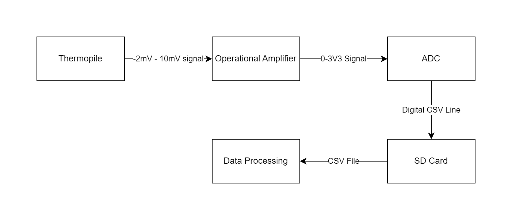

# Thermopile ZTP-148 Payload Guide <!-- omit from toc -->

### Table of Contents <!-- omit from toc -->
- [Objectives](#objectives)
- [Requirements](#requirements)
- [Resources](#resources)
- [Procedure](#procedure)


## Objectives
1. Identify problems within the flight software code.
2. Systematically debug the identified problems.

## Requirements
1. STM32CubeIDE installed on device
1. Pen and paper
1. STM32L432KC Microcontroller with usb a to micro usb cable

## Resources
- STM32L4 Datasheet link: https://www.st.com/resource/en/reference_manual/rm0394-stm32l41xxx42xxx43xxx44xxx45xxx46xxx-advanced-armbased-32bit-mcus-stmicroelectronics.pdf
- Coding in STM32CubeIDE: https://wiki.st.com/stm32mcu/wiki/STM32StepByStep:Getting_started_with_STM32_:_STM32_step_by_step
- Thermopile TI exploration: https://www.ti.com/document-viewer/lit/html/SSZT108#:~:text=By%20maximizing%20the%20amount%20of,resolution%20of%20your%20thermopile%20application.
- 

## Procedure

## 1.0 Elecrical

### 1.0.1 Understanding the component

### 1.0.2 Understanding analog circuits

**What is a time constant?**


[time constant vs response time](https://www.baranidesign.com/faq-articles/2019/5/6/difference-between-sensor-response-time-and-sensor-time-constant-tau#:~:text=The%20Time%20Constant%20of%20a,this%20case%20the%20new%20temperature.)

### 1.1 Block Diagram


**Signal Flowchart**



### 1.2 Schematic/Breadboard Diagram


**Pin Map**


### 1.3 Breadboard Circuit

**SOFTWARE TIME!**

**1.3.1 TESTING/DEBUGGING**

### 1.4 Protoboard Circuit

**1.3.1 TESTING/DEBUGGING**

## 2.0 Software

### 2.1 Pseudo code?

```
loop indefinitely
    
    poll ADC 
    read ADC value and assign to Temp_variable

    print value to serial (for testing)

    print value in csv to SD card

```

### 2.2 STM32CubeIDE Initialisation
Follow [2.1](../../2.%20Payload%20Software%20Development/2.1.%20Getting%20Started%20with%20STM32%20Microcontroller%20Programming/Readme.md), [2.2](../../2.%20Payload%20Software%20Development/2.2.%20Reading%20Sensors%20With%20a%20Microcontroller/Readme.md), [2.3](../../2.%20Payload%20Software%20Development/2.3.%20Manipulating%20and%20Storing%20Sensor%20Data%20with%20a%20Microcontroller/Readme.md).
To gain a baseline setup as we will use ADC1 IN5 for interpreting the analog signal.

### 2.3 CODE!

```c++
while(1)
{
    HAL_ADC_Start(&hadc1); // ADD COMMENT
    HAL_ADC_PollForConversion(&hadc1, 1); // ADD COMMENT

    internal_temp = HAL_ADC_GetValue(&hadc1);

    sprintf(*serial_string, "Current Temperature: %d \r\n", internal_temp); //Assign string buffer to the temperature value

    HAL_UART_Transmit(&huart1, (uint8_t *)serial_string, sizeof(serial_string), 10); //transmit serial_string using USART1

    HAL_Delay(500);
}
```


### 2.4 SAVE TO CSV

**OUTSIDE WHILE LOOP**

```c++
/* USER CODE BEGIN 2 */
HAL_Delay(2000); //delay to prevent double printing after reboot during programming

sprintf(string_buffer, "Hello from STM32L4 via UART.\r\n"); //load serial string buffer
HAL_UART_Transmit(&huart1, (uint8_t *)string_buffer, strlen(string_buffer), 10); //transmit serial_string with a 10ms timeout using USART1

HAL_Delay(1000); //delay to let SD card finish initialisation

sprintf(string_buffer, "Finished SD card initialisation delay.\r\n"); //load serial string buffer
HAL_UART_Transmit(&huart1, (uint8_t *)string_buffer, strlen(string_buffer), 10); //transmit serial_string with a 10ms timeout using USART1

//some variables for FatFs
FATFS FatFs; 	//Fatfs handle
FIL f; 		//File handle
FRESULT fr; //Result after operations

//Open the file system
fr = f_mount(&FatFs, "", 1); //1=mount now
if (fr != FR_OK)
{
sprintf(string_buffer, "File mount error: (%i)\r\n", fr);
HAL_UART_Transmit(&huart1, (uint8_t *)string_buffer, strlen(string_buffer), 10); //transmit serial_string with a 10ms timeout using USART1
while(1); // stop here if there was an error
}

UINT bytes_written;

fr = f_open(&f, "data.csv", FA_WRITE | FA_OPEN_APPEND);
if(fr == FR_OK) {
    sprintf(string_buffer, "Opened data.csv for writing (appending lines)\r\n");
    HAL_UART_Transmit(&huart1, (uint8_t *)string_buffer, strlen(string_buffer), 10); //transmit serial_string with a 10ms timeout using USART1
}
else {
    sprintf(string_buffer, "f_open error (%i)\r\n", fr);
    HAL_UART_Transmit(&huart1, (uint8_t *)string_buffer, strlen(string_buffer), 10); //transmit serial_string with a 10ms timeout using USART1
}
```

**INSIDE WHILE LOOP**

```c++
sprintf(string_buffer, "An additional line.\r\n");
fr = f_write(&f, string_buffer, strlen(string_buffer), &bytes_written);
if (fr == FR_OK) {
    sprintf(string_buffer, "Wrote %i bytes to data.csv.\r\n", bytes_written);
    HAL_UART_Transmit(&huart1, (uint8_t *)string_buffer, strlen(string_buffer), 10); //transmit serial_string with a 10ms timeout using USART1
}
else {
    sprintf(string_buffer, "f_write error (%i)\r\n", fr);
    HAL_UART_Transmit(&huart1, (uint8_t *)string_buffer, strlen(string_buffer), 10); //transmit serial_string with a 10ms timeout using USART1
}
```

## 3.0 Data Processing

### 3.1 Reading CSV

### 3.2 Human Readable Information

### 3.3 Graphs

### 3.4 Statistics
- Highest/lowest measurement
- Average measurement
- Other cool stats