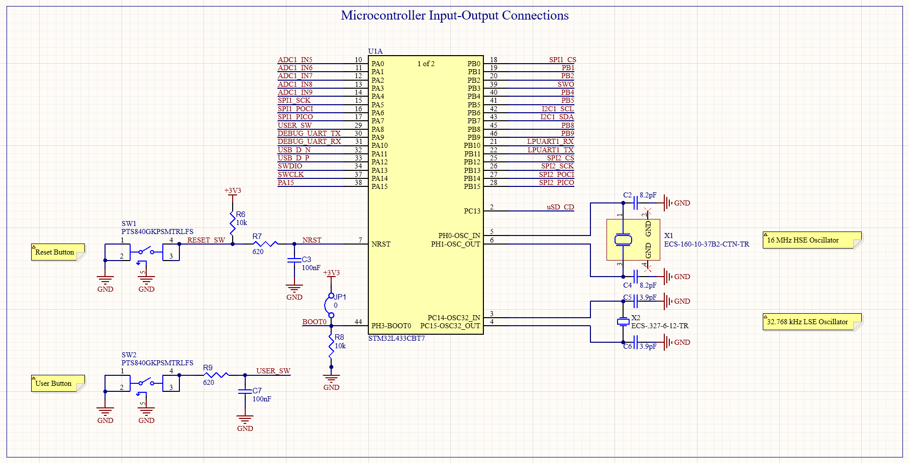

## Resources

- Bosch Sensortec BMP390 Datasheet: https://www.bosch-sensortec.com/media/boschsensortec/downloads/datasheets/bst-bmp390-ds002.pdf
- Adafruit BMP3XX Library on GitHub: https://github.com/adafruit/Adafruit_BMP3XX (for reference, not used directly)
- "Getting Started with STM32 - How to Use SPI" Digikey article by Shawn Hymel: https://www.digikey.com.au/en/maker/projects/getting-started-with-stm32-how-to-use-spi/09eab3dfe74c4d0391aaaa99b0a8ee17
- STM32 SPI Gotcha article: http://efton.sk/STM32/gotcha/g21.html

## Payload Electronics Hardware

### Rocket Payload Microcontroller Board Pin Labels


### Microcontroller IO Connections


1. Wire up the pressure sensor on the breakout board according to the reccomended conection diagram for 3 or 4 wire SPI operation in section 6.2 on page 47 of the datasheet:


> *We will be using 4 wire SPI with separate signal wires for serial data in and serial data out.*

**TODO**

## Payload Software

1. Pressure Sensor Pin Assignments

    


2. Pressure Sensor SPI1 Configuration

    

3. Generate code

<!-- 4. In "main.h" in "Private defines" user code section between "USER CODE BEGIN Private defines" and "USER CODE END Private defines":

    ```c++
    //write bit for BMP390 pressure sensor SPI communications (MSB)
    #define BMP390_WB 0x80
    ``` -->

4. In "main.c in "PV" user code section between "USER CODE BEGIN PV" and "USER CODE END PV":

    ```c++
    const uint8_t BMP390_READ_SERIAL_NUMBER[3] = {0x80, 0x00, 0x00}; //address to read pressure sensor chip serial number including read-write bit (MSB) and dummy byte (second byte)
    static uint8_t spi_rx_buffer[3] = 0; //buffer for SPI Rx
    ```

5. In "main.c in "2" user code section between "USER CODE BEGIN 2" and "USER CODE END 2":

    ```c++
    
    ```

## Constants for I2C Communication

```c++
//constants for BMP390 I2C addresses and register addresses
static const uint8_t BMP390_I2C_ADDR_SDO_0 = 0x76<<1; // BMP390 I2C Address when SDO is low, shifted to the left one for use with the STM32 HAL
static const uint8_t BMP390_I2C_ADDR_SDO_1 = 0x77<<1; // BMP390 I2C Address when SDO is high, shifted to the left one for use with the STM32 HAL
static const uint8_t BMP390_CHIP_ID_REG_ADDR = 0x00; //BMP390 chip ID register address
static const uint8_t BMP390_PRESSURE_REG_ADDR = 0x04; //BMP390 pressure register (start) address
static const uint8_t BMP390_PRESSURE_NUM_BYTES = 3; //BMP390 number of bytes for pressure data
static const uint8_t BMP390_TEMP_REG_ADDR = 0x07; //BMP390 temperature register (start) address
static const uint8_t BMP390_TEMP_NUM_BYTES = 3; //BMP390 number of byts for temperature data
static const uint8_t BMP390_PWR_CTRL_REG_ADDR = 0x1B; //BMP390 PWR_CTRL register for mode setting & pressure & temperature enable bits

//constants for PWR_CTRL register
static const uint8_t BMP390_NORMAL_MODE = 0x30; //bits to enable normal mode operation
static const uint8_t BMP390_PRESS_EN = 0x01; //bits to enable pressure measurements
static const uint8_t BMP390_TEMP_EN = 0x02; //bits to enable temperate measurements
```

## CubeMX Example


## Example wait for device ready
(May not be required)
```c++
while(HAL_I2C_IsDeviceReady(&hi2c1, BMP390_I2C_ADDR_SDO_0, 1, HAL_MAX_DELAY));
```

## Example I2C Write
```c++
//create uint8_t (array) buffer to use for I2C communication
uint8_t i2c_buf[20];

//write bytes into I2C buffer for I2C write operation
i2c_buf[0] = BMP390_PWR_CTRL_REG_ADDR; //PWR_CTRL register address
i2c_buf[1] = BMP390_NORMAL_MODE | BMP390_PRESS_EN | BMP390_TEMP_EN; //assembly command byte using constants and bitwise or

HAL_I2C_Master_Transmit(&hi2c1, BMP390_I2C_ADDR_SDO_0, i2c_buf, 2, HAL_MAX_DELAY); //I2C transmit
```

## Extension

- Use hardware interrupts and the sensor's data ready pin to make the communication with the sensor more efficient (with it's use of CPU time).