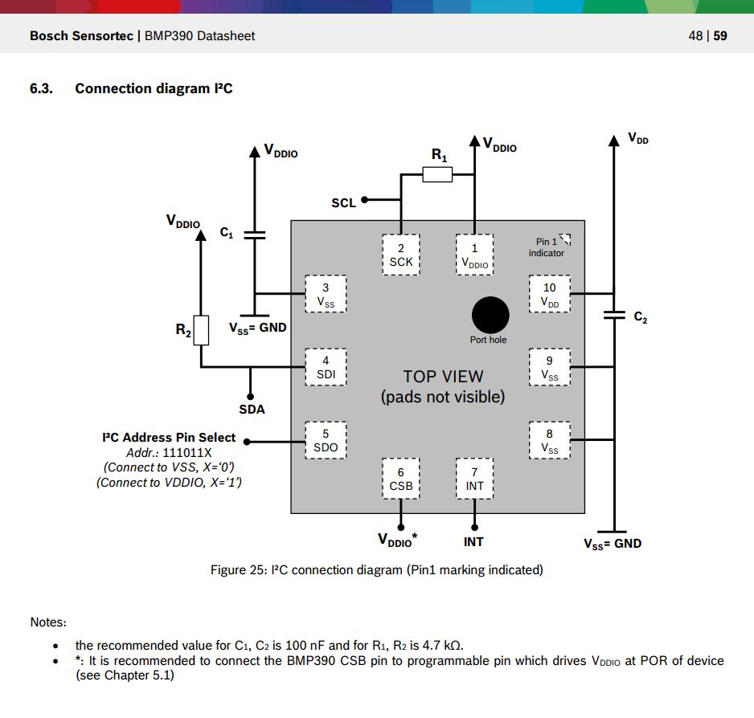

## Resources

- Bosch Sensortec BMP390 Datasheet: https://www.bosch-sensortec.com/media/boschsensortec/downloads/datasheets/bst-bmp390-ds002.pdf
- Adafruit BMP3XX Library on GitHub: https://github.com/adafruit/Adafruit_BMP3XX (for reference, not used directly)
- "Getting Started with STM32 - How to Use SPI" Digikey article by Shawn Hymel: https://www.digikey.com.au/en/maker/projects/getting-started-with-stm32-how-to-use-spi/09eab3dfe74c4d0391aaaa99b0a8ee17
- STM32 SPI Gotcha article: http://efton.sk/STM32/gotcha/g21.html

## Payload Electronics Hardware

### Rocket Payload Microcontroller Board Pin Labels


### Microcontroller IO Connections


1. Wire up the pressure sensor on the breakout board according to the reccomended conection diagram for I2C operation in section 6.23 on page 48 of the datasheet:



**TODO**

## Payload Software

1. Pressure Sensor Pin Assignments

    


2. Pressure Sensor SPI1 Configuration

    

3. Generate code

<!-- 4. In "main.h" in "Private defines" user code section between "USER CODE BEGIN Private defines" and "USER CODE END Private defines":

    ```c++
    //write bit for BMP390 pressure sensor SPI communications (MSB)
    #define BMP390_WB 0x80
    ``` -->

4. In "main.c in "PV" user code section between "USER CODE BEGIN PV" and "USER CODE END PV" add in the following constants defining addresses and bits to control some aspects of the pressure sensor (you will have to add some more later):

    ```c++
    //BMP390 I2C addresses
    static const uint8_t BMP390_I2C_ADDR_SDO_0 = 0x76<<1; // BMP390 I2C Address when SDO is low, shifted to the left one for use with the STM32 HAL
    static const uint8_t BMP390_I2C_ADDR_SDO_1 = 0x77<<1; // BMP390 I2C Address when SDO is high, shifted to the left one for use with the STM32 HAL

    //BMP390 register addresses
    static const uint8_t BMP390_CHIP_ID_REG_ADDR = 0x00; //BMP390 chip ID register address
    static const uint8_t BMP390_PRESSURE_REG_ADDR = 0x04; //BMP390 pressure register (start) address
    static const uint8_t BMP390_PRESSURE_NUM_BYTES = 3; //BMP390 number of bytes for pressure data
    static const uint8_t BMP390_TEMP_REG_ADDR = 0x07; //BMP390 temperature register (start) address
    static const uint8_t BMP390_TEMP_NUM_BYTES = 3; //BMP390 number of bytes for temperature data
    static const uint8_t BMP390_PWR_CTRL_REG_ADDR = 0x1B; //BMP390 PWR_CTRL register for mode setting & pressure & temperature enable bits

    //control bits for PWR_CTRL register
    static const uint8_t BMP390_NORMAL_MODE = 0x30; //bits to enable normal mode operation
    static const uint8_t BMP390_PRESS_EN = 0x01; //bits to enable pressure measurements
    static const uint8_t BMP390_TEMP_EN = 0x02; //bits to enable temperate measurements
    ```

5. In "main.c in "2" user code section between "USER CODE BEGIN 2" and "USER CODE END 2" add the following code to configure the sensor in "normal" mode and enable pressure and temperature readings:

    ```c++
    uint8_t i2c_buf[10]; //buffer use for i2c communications

    static uint8_t chip_id = 0xFF;
    static uint32_t pressure = 0;
    static uint32_t temp = 0;
    
    //I2C write to change to normal mode and enable pressure and temperature measurements
    //assemble buffer for I2C transmission
    i2c_buf[0] = BMP390_PWR_CTRL_REG_ADDR; //register address
    i2c_buf[1] = BMP390_NORMAL_MODE | BMP390_PRESS_EN | BMP390_TEMP_EN; //normal mode, pressure measurements enables, temperature measurements enabled
    HAL_I2C_Master_Transmit(&hi2c1, BMP390_I2C_ADDR_SDO_0, i2c_buf, 2, HAL_MAX_DELAY); //I2C transmission
    ```

6. In you "WHILE" user code section inside the while(1) loop, above "USER CODE END WHILE" add in the following to read the uncalibrated pressure value and print it to the terminal:

```c++
HAL_I2C_Master_Transmit(&hi2c1, BMP390_I2C_ADDR_SDO_0, &BMP390_TEMP_REG_ADDR, 1, HAL_MAX_DELAY);
HAL_I2C_Master_Receive(&hi2c1, BMP390_I2C_ADDR_SDO_0, i2c_buf, BMP390_TEMP_NUM_BYTES, HAL_MAX_DELAY);

temp = i2c_buf[0] | i2c_buf[1]<<8 | i2c_buf[2]<<16; //assemble bytes into one 32 bit variable to hold 24 bit value, there might be a better way to do this by typecasting

//    sprintf(string_buffer, "BMP390 serial number:%02X.\r\n", chip_id); //load serial string buffer with serial number
sprintf(string_buffer, "Temp:%lu\r\n", temp); //load serial string buffer with serial number
HAL_UART_Transmit(&huart1, (uint8_t *)string_buffer, strlen(string_buffer), 10); //transmit serial_string with a 10ms timeout using USART1

HAL_Delay(500);
```

7. Now implement the calibration yourself, then add in the functionality to save the data to the microSD card from the previous session.

## Extension

- Investigate the sampling speed options and select the best option for your purposes.
- Decide if you want to use the timestamp from the sensor, or use some other timesource for your timestamp column in your .csv file.
- Investigate the sensor's built in filtering, and select the best option for your purposes.
- Use hardware interrupts and the sensor's data ready pin to make the communication with the sensor more efficient (with it's use of CPU time).